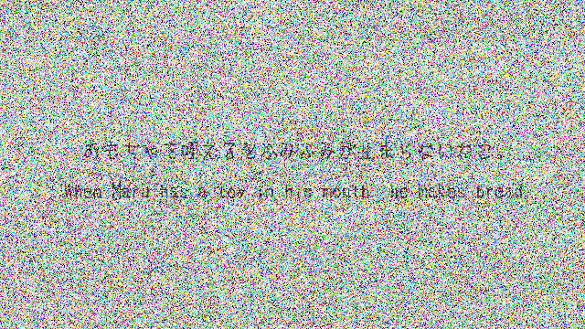
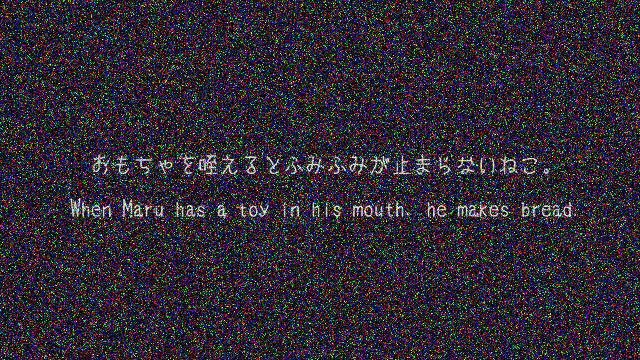
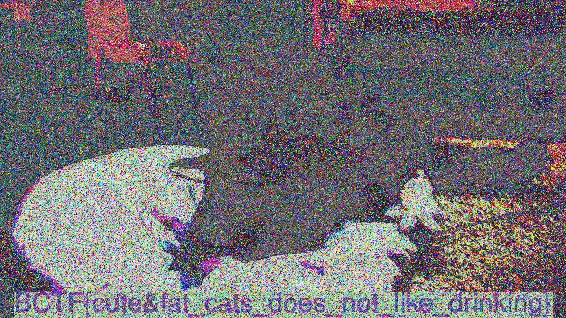

# catvideo Score: 150
`forensic` Solved by 135 Teams

cat_video.mp4
[Google Drive](https://drive.google.com/file/d/0B6h1j8zoGOHyQk9vNUg4dEltQk0/view) &emsp;
[pan.baidu.com](http://pan.baidu.com/s/1eQRokOM)&emsp;
[Dropbox](https://dl.dropboxusercontent.com/u/23229783/catvideo-497570b7e2811eb52dd75bac9839f19d7bca5ef4.mp4)&emsp;
[MEGA](https://dl.dropboxusercontent.com/u/23229783/catvideo-497570b7e2811eb52dd75bac9839f19d7bca5ef4.mp4)

# Writeup
参考他人wp,原文在下方。本意仅因多数wp较简略，阅读困难
## 0x00 分析
* 文件信息
 + 文件类型：mp4
 + 时长：1:04,
 + 文件名：catvideo,猜测为跟猫相关的视频
 + 题型：forensic猜测可能是基于MPEG4的隐写或水印。
* 打开视频，发现是一堆雪花点，以往没有见过这种情况
* 使用winhex没有发现疑点

## 0x01 尝试
观察视频，发现视频前三秒仅屏幕中央发生变化；然后有一次较大的变动，之后貌似有一只猫在动。

因为整个视频的变动较小，于是对视频取不同的帧，进行异或运算。

这里使用potplayer播放器和stegosolve.jar进行简单测试：
1. ctrl+alt+e 截屏 `img/cat1.jpg`
2. 按F键跳到下几帧 约3秒处ctrl+alt+e 截屏 `img/cat2.jpg`
3. 使用stegosolve进行异或运算

结果发现隐约可以发现两行字



猜测内容为When Maru has a toy in his mouth, he ???? ?????

在youtube上检索，得到一个1:04的视频，下载下来仔细观察，发现前3秒确实是中间有两行字，为日本网民上传的关于猫的视频

## 0x02 取证
* 原理：推测水印仅出现在部分帧或水印一直存在但视频首尾会有较大变化，而本视频内容变化较小，加入了雪花噪声，因此只需要取视频各帧，前后进行异或
* 工具:ffmpeg
* code 'ffmpeg in cmd'

```
ffmpeg -i catvideo.mp4 -r 1/1 stego/%03d.jpg
```
* code 'xorjpg.py'

```
#!/usr/bin/python
from PIL import Image
import sys

##if len(sys.argv) < 3:
##    print 'Usage: xorimg.py <image 1> <image 2> <output image>'
##    sys.exit()

for i in range(1,67):# here are 67 images convert from ffmpeg
    if i < 9:
        a = '0'+'0'+str(i)+'.jpg';
        b = '0'+'0'+str(i+1)+'.jpg';
        print a,b
    else:
        if i == 9:
            a = '0'+'0'+str(i)+'.jpg';
            b = '0'+str(i+1)+'.jpg';
            print a,b
        else:
            a = '0'+str(i)+'.jpg';
            b = '0'+str(i+1)+'.jpg';
            print a,b
    img1 = a
    img2 = b
    out = 'out'+str(i)+'.jpg'

    pic1 = Image.open(img1)
    pic2 = Image.open(img2)
    pic2 = pic2.resize(pic1.size) # it's a little unwanted
    newpic = Image.new('RGB', pic1.size)

    for y in range(pic1.size[1]):
        for x in range(pic1.size[0]):
            pixel1 = pic1.getpixel((x, y))
            pixel2 = pic2.getpixel((x, y))
            newpixel = []
            for p in range(len(pixel1[:3])):# why 3? cause rgb
                newpixel.append(pixel1[p] ^ pixel2[p])
            newpixel = tuple(newpixel)
            newpic.putpixel((x, y), newpixel)

    newpic.save(out)
```

* 结果





the flag is BCTF{cute&fat_cats_does_not_like_drinking}
# Exsiting Writeup
http://veganzombies.org/writeups/2016/03/21/BCtf-catvideo.html
