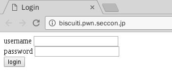

# SECCON 2016: biscuiti

**source:** [ctftime](https://ctftime.org/task/3176)
**Category:** Web, Crypto
**Points:** 300
**Description:**

> Can you login as admin?
>
> http://biscuiti.pwn.seccon.jp/
>
> [biscuiti.zip](http://files.quals.seccon.jp/biscuiti.zip)

## Write-up
### 1. challenge description
非常有趣的一道题，网址指向的是一个单纯的登陆页面<br>


同时，题目给出了源码`index.php`, `logout.php`
### 2. working principle
阅读源码，可以知道，整个网页的工作原理如下
#### 2.1 sql查询
用户输入`username`, `password`，后台通过sqlite查询是否存在此用户<br>
`$result = $dbh->query("SELECT username, enc_password from user WHERE username='{$username}'");`

#### 2.2 验证密码正确性
如果可以找到记录则判断密码是否正确<br>
`auth($u["enc_password"], $password)`

`auth()`函数中使用`openssl_decrypt`对数据库中保存的`enc_password`字段进行解密，加密算法为`aes-128-cbc`, 密钥在`index.php`开头定义，被出题人替换了。`enc_password`前16位作为iv（initial value), 16位以后的内容作为密文。
```
function auth($enc_password, $input) {
    $enc_password = base64_decode($enc_password);
    $iv = substr($enc_password, 0, 16);
    $c = substr($enc_password, 16);
    $password = openssl_decrypt($c, ENC_METHOD, ENC_KEY, OPENSSL_RAW_DATA, $iv);
    return $password == $input;
}
```

#### 2.3 session处理
如果密码正确，则保存`session`，包括`username`和`isadmin`， 但sql查询中并没有`isadmin`的结果。
```
$u = $result->fetch(PDO::FETCH_ASSOC);
if ($u && auth($u["enc_password"], $password)) {
    $SESSION["name"] = $u['username'];
    $SESSION["isadmin"] = $u['isadmin'];
    save_session();
    info_page();
}
```

将`SESSION`序列化，并对`SESSION`进行加密，将序列化后的`SESSION`连同密文发送至客户端的`COOKIE`中。
```
function save_session() {
    global $SESSION;
    $j = serialize($SESSION);
    $u = $j . mac($j);
    setcookie("JSESSION", base64_encode($u));
}
```

其中`mac()`函数主体为`openssl_encrypt`, 加密算法、密钥与`auth()`函数中相同，`iv`为`'\0'\*16`，返回密文的最后16位（即cbc的一个block）。
```
function mac($input) {
    $iv = str_repeat("\0", 16);
    $c = openssl_encrypt($input, ENC_METHOD, ENC_KEY, OPENSSL_RAW_DATA, $iv);
    return substr($c, -16);
}
```

如果用户未提交用户名密码，但是已经存在了`COOKIE`, 执行`load_session()`,验证用户的`SESSION`是否经过伪造。 取session的明文部分，经过`mac()`加密，与`SESSION`中的密文部分比较，如果两者`===`，则对明文部分反序列化。
```
function load_session() {
    global $SESSION;
    if (!isset($_COOKIE["JSESSION"]))
        return array();
    $u = base64_decode($_COOKIE["JSESSION"]);
    $j = substr($u, 0, -16);
    $t = substr($u, -16);
    if (mac($j) !== $t)
        return array(2);
    $SESSION = unserialize($j);
}

```

#### 2.4 info_page()
如果`SESSION["isadmin"]`为真，则得到flag。
```
if ($SESSION["isadmin"])
    include("../flag");
```

### 3. setup local environment
理解了网页的工作原理后，我们在本地搭建实验环境。这样做的好处有二：
1. 远端的网页，响应起来较慢，不利于我们调试脚本
2. 本地搭建，对于这道题利用的技术，产生的漏洞理解更加深刻

为了将自己遇到的题目记录下来，方便共享这里。使用docker，使用的镜像是ubuntu最新版本，以下均为dockerfile的内容
```
FROM ubuntu:latest
MAINTAINER ssst0n3
# 更新源
apt-get update
# 安装add-apt-repository
apt-get install python-software-properties
apt-get install software-properties-common
# 安装语言包，使用utf8添加ppa
RUN apt-get install -y language-pack-en-base
RUN LC_ALL=en_US.UTF-8 add-apt-repository ppa:ondrej/php
# 更新源
apt-get update
# 安装php7.0, php7.0-sqlite3
apt-get install php7.0 php7.0-sqlite3

```


## Other write-ups and resources
### writeups
* <https://blog.tinduong.pw/2016/12/11/seccon-quals-2016-biscuiti-web-crypto-300-write-up/>
* <http://crypto.rop.sh/post/2ODE1D5GNUUH>
* <https://gist.github.com/sonickun/dba8163394b849f70b968690c02c169b>
* <http://www.burnegg.com/index.php/archives/20/>
* <http://blog.csdn.net/qq_19876131/article/details/53674972>

### resources
* <>
