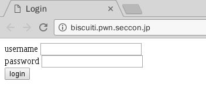
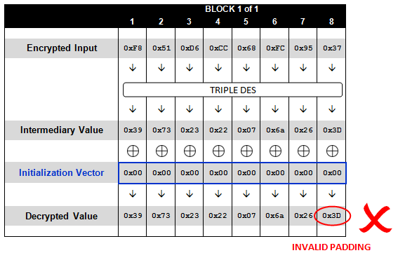
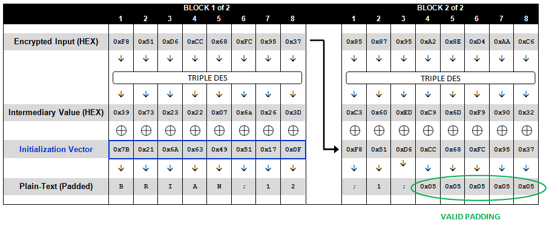

# SECCON 2016: biscuiti

**source:** [ctftime](https://ctftime.org/task/3176)
**Category:** Web, Crypto
**Points:** 300
**Description:**

> Can you login as admin?
>
> http://biscuiti.pwn.seccon.jp/
>
> [biscuiti.zip](http://files.quals.seccon.jp/biscuiti.zip)

## Write-up
### 1. challenge description
非常有趣的一道题，网址指向的是一个单纯的登陆页面<br>


同时，题目给出了源码`index.php`, `logout.php`
### 2. working principle
阅读源码，可以知道，整个网页的工作原理如下
#### 2.1 sql查询
用户输入`username`, `password`，后台通过sqlite查询是否存在此用户<br>
`$result = $dbh->query("SELECT username, enc_password from user WHERE username='{$username}'");`

#### 2.2 验证密码正确性
如果可以找到记录则判断密码是否正确<br>
`auth($u["enc_password"], $password)`

`auth()`函数中使用`openssl_decrypt`对数据库中保存的`enc_password`字段进行解密，加密算法为`aes-128-cbc`, 密钥在`index.php`开头定义，被出题人替换了。`enc_password`前16位作为iv（initial value), 16位以后的内容作为密文。
```
function auth($enc_password, $input) {
    $enc_password = base64_decode($enc_password);
    $iv = substr($enc_password, 0, 16);
    $c = substr($enc_password, 16);
    $password = openssl_decrypt($c, ENC_METHOD, ENC_KEY, OPENSSL_RAW_DATA, $iv);
    return $password == $input;
}
```

#### 2.3 session处理
如果密码正确，则保存`session`，包括`username`和`isadmin`， 但sql查询中并没有`isadmin`的结果。
```
$u = $result->fetch(PDO::FETCH_ASSOC);
if ($u && auth($u["enc_password"], $password)) {
    $SESSION["name"] = $u['username'];
    $SESSION["isadmin"] = $u['isadmin'];
    save_session();
    info_page();
}
```

将`SESSION`序列化，并对`SESSION`进行加密，将序列化后的`SESSION`连同密文发送至客户端的`COOKIE`中。
```
function save_session() {
    global $SESSION;
    $j = serialize($SESSION);
    $u = $j . mac($j);
    setcookie("JSESSION", base64_encode($u));
}
```

其中`mac()`函数主体为`openssl_encrypt`, 加密算法、密钥与`auth()`函数中相同，`iv`为`'\0'\*16`，返回密文的最后16位（即cbc的一个block）。
```
function mac($input) {
    $iv = str_repeat("\0", 16);
    $c = openssl_encrypt($input, ENC_METHOD, ENC_KEY, OPENSSL_RAW_DATA, $iv);
    return substr($c, -16);
}
```

如果用户未提交用户名密码，但是已经存在了`COOKIE`, 执行`load_session()`,验证用户的`SESSION`是否经过伪造。 取session的明文部分，经过`mac()`加密，与`SESSION`中的密文部分比较，如果两者`===`，则对明文部分反序列化。
```
function load_session() {
    global $SESSION;
    if (!isset($_COOKIE["JSESSION"]))
        return array();
    $u = base64_decode($_COOKIE["JSESSION"]);
    $j = substr($u, 0, -16);
    $t = substr($u, -16);
    if (mac($j) !== $t)
        return array(2);
    $SESSION = unserialize($j);
}

```

#### 2.4 info_page()
如果`SESSION["isadmin"]`为真，则得到flag。
```
if ($SESSION["isadmin"])
    include("../flag");
```

### 3. setup local environment
理解了网页的工作原理后，我们在本地搭建实验环境。这样做的好处有二：

1. 远端的网页，响应起来较慢，不利于我们调试脚本
2. 本地搭建，对于这道题利用的技术，产生的漏洞理解更加深刻

#### 3.1 安装apache2, php7.0, sqlite3
```
sudo apt-get -y install apache2 php7.0 php7.0-sqlite3 libapache2-mod-php
```

#### 3.2 配置sqlite3、php源码、flag
根据`index.php`源码中给出的sql语句，配置sqlite3。

    首先将以下语句写入到`users.sql`中
```
CREATE TABLE user (
username VARCHAR(255),
enc_password VARCHAR(255),
isadmin BOOLEAN
);
INSERT INTO user VALUES ("admin", "***censored***", 1);
```
接着，使用sqlite3创建`users.db`，导入`users.sql`
```
sqlite3 users.db
sqlite> .read users.sql
sqlite> .quit
```
将得到的`users.db`文件复制到`index.php`和`logout.php`上级目录中的db文件夹中，并创建flag文件

整个环境结构如下
```
.
├── biscuiti
│   ├── biscuiti.zip
│   ├── index.php
│   └── logout.php
├── db
│   └── users.db
└── flag
```

#### 3.3 dockerfile
为了将自己遇到的题目记录下来，方便共享。这里使用[docker](https://docs.docker.com/engine/getstarted/)，使用的镜像是ubuntu最新版本，使用以下命令即可部署到本地
```
docker pull sysucsa/ctfs_docker:seccon2016_web_biscuiti
docker run -d -p 8000:80 sysucsa/ctfs_docker:seccon2016_web_biscuiti
```

### 4. vulnerabilities
#### 4.1 sql injection
未对`username`字段过滤，导致sql注入
```
$username = (string)$_POST['username'];
$password = (string)$_POST['password'];
$dbh = new PDO('sqlite:../db/users.db');
$result = $dbh->query("SELECT username, enc_password from user WHERE username='{$username}'");
```

#### 4.2 PHP Type Juggling
`auth()`函数中判断密钥是否相等，用的是`==`，存在弱类型绕过的可能。
```
function auth($enc_password, $input) {
    $enc_password = base64_decode($enc_password);
    $iv = substr($enc_password, 0, 16);
    $c = substr($enc_password, 16);
    $password = openssl_decrypt($c, ENC_METHOD, ENC_KEY, OPENSSL_RAW_DATA, $iv);
    return $password == $input;
}
```

#### 4.3 constant initial value
`index.php`中所有用来加密的初始值，都是`'\0'\*16`, 这里与`sql injection`一同利用，存在`padding oracle attack`。
```
function mac($input) {
    $iv = str_repeat("\0", 16);
    $c = openssl_encrypt($input, ENC_METHOD, ENC_KEY, OPENSSL_RAW_DATA, $iv);
    return substr($c, -16);
}
```

#### 4.4 session unserialize
`$SESSION`值经序列化后与`mac`一同存储在`cookies`中，可被反序列化，伪造SESSION字段。但需要保证`mac(serialize($SESSION))`相同。

### 5. exploit
阅读`index.php`，可知，如需拿到flag，需要`$SESSION["isadmin"]`为1。但sql语句并未查询`isadmin`字段，即使密码正确`$SESSION`中也无`isadmin`字段。欲得flag，需要：
* 构造sql注入，绕过密码验证
* 伪造`cookies`中的`session`，并保证后缀的`mac`值与`session`加密后一致

#### 5.1 利用sql注入漏洞获得cookies
可以利用如下`payload`绕过`password`验证<br>
`username=' union select 'username', '`

该`payload`组成的sql查询结果集为`(username, enc_password)=("username", "")`。

`enc_password`字段为空时，`auth()`函数中`openssl_decrypt()`将返回`false`，此时如果输入的`password`字段也为空，则`false==""`成立，`auth()`函数返回`True`。

> `openssl_decrypt()`解`cipher block chaining`时，如果遇到`padding`异常时，会返回`false`, 如下图所示。<br>
> <br>
> 因此，如果`enc_password`字段不为空，也可导致其返回`False`。如果`enc_password`可以解密成功，则返回明文，此时输入相同的`password`字段，则`auth()`函数返回`True`。因此存在`padding oracle attack`。

关于`cipher block chaining`对于`padding`是如何处理的，将在`5.2 利用padding oracle attack伪造session`中细说。

输入`payload`给服务器，得到cookies如下。至于为何`username`为`a`\*26, 同样在后面说。<br>
```
'a:2:{s:4:"name";s:26:"aaaaaaaaaaaaaaaaaaaaaaaaaa";s:7:"isadmin";N;}\xa3\xb2F9\xd0\x1b\xee\x87\x17NF\xe2\xed\x07W\xe9'
```

#### 5.2 利用padding oracle attack伪造session
##### 5.2.1 攻击原理
上面说到存在`padding oracle attack`，但具体可以得到什么没有细说。关于`padding oracle attack`的具体原理，可以看这篇博客<http://blog.zhaojie.me/2010/10/padding-oracle-attack-in-detail.html>。

这里使用的`padding oracle attack`用法不太一样，一般是希望通过已知的密文，恢复出明文。而这里我们需要得到的是密文，从而凑得包含`isadmin`字段的部分密文。

`cipher block chaining`类算法加密时，会将明文分块，这样就导致最后一个block与其他block长度不一致，需要作填充。常见的填充标准有`PKCS#5`，`PKCS#7`。这里使用的是`PKCS#7`, 每个数据块为16个字节。

最后一个block长度为15，则补充`1`个`0x01`;<br>
最后一个block长度为14，则补充`2`个`0x02`;<br>
最后一个block长度为13，则补充`3`个`0x03`;<br>
....<br>
如果最后一个block长度为16， 则在最后追加一个block，为`16`个`0x00`。

`cipher block chaining`解密时，先将密文经过算法解密得到imd(intermediary value), 再与前一个密文块异或得到明文。其中，最后一个明文块必须包含`padding`<br>


如果明文中的`padding`不符合上述规则，则抛出异常。

我们已知密文的最后一个block, 我们构造其一个block密文，通过判断`padding`是否异常，即可得到上一个密文block。

如`openssl_decrypt()`抛出异常返回`False`，则`False==''`，`auth()`函数返回`True`。否则，得到上一个密文block的某位密文。

##### 5.2.2 构造最后一个密文block相同的session
根据`5.2.1`所说，我们可以通过`padding oracle attack`得到所有的密文块：
```
plain[0]  a:2:{s:4:"name";    cipher[0]
plain[1]  s:26:"aaaaaaaaaa    cipher[1]
plain[2]  aaaaaaaaaaaaaaaa    cipher[2]
plain[3]  ";s:7:"isadmin";    cipher[3]
plain[4]  N;}   chr(13)*13    cipher[4]
```

当`username`输入26(当然，更多也可)个字符时，才能得到一整块可以任意控制的明文(即`plain[2]`)，从而改变`plain[4]`的内容得到正确的session。

至于如何构造`plain[2]`, 使得`mac(new_plain)`与`mac(plain)`相等呢？

现在`plain[4]`需要改变, `cipher[4]`也将随之改变。 即明文，密文块变为：
```
plain[0]          a:2:{s:4:"name";    cipher[0]
plain[1]          s:26:"aaaaaaaaaa    cipher[1]
plain[2]          aaaaaaaaaaaaaaaa    cipher[2]
plain[3]          ";s:7:"isadmin";    cipher[3]
target_plain[4]   b:1;} chr(11)*11    target_cipher[4]
```

如果我们可以得到`target_cipher[4]`，即可成功伪造`session`。

而我们可以构造的只有`username`字段，即事实上可以构造的只有`plain[2]`,`plain[4]`无法改动。根据`cipher block chaining`, `cipher[2], cipher[3], cipher[4]`都将随之变化。根据`padding oracle attack`, 我们同样可以获得所有密文块。
```
plain[0]      a:2:{s:4:"name";    cipher[0]
plain[1]      s:26:"aaaaaaaaaa    cipher[1]
new_plain[2]  ????????????????    new_cipher[2]
plain[3]      ";s:7:"isadmin";    new_cipher[3]
plain[4]      N;}   chr(13)*13    new_cipher[4]
```

可变的明文块为`new_plain[2]`, 可变的密文块为`new_cipher[2], new_cipher[3], new_cipher[4]`。我们能否利用以上各个明文块、密文块获得`target_cipher[4]`呢？

欲获得`target_cipher[4]`值，我们需构造`new_cipher[2], new_cipher[3], new_cipher[4]`中的一个值与`target_cipher[4]`相等。

`new_cipher[2]`最可行，只需经过一次加密函数。
```
target_cipher[4] = cipher(xor(cipher[3], target_plain[4]))
new_cipher[2] = cipher(xor(cipher[1], new_plain[2]))
```

令`plain[2] = xor(cipher[1], cipher[3], target_plain[4])`，即可通过`new_cipher[2]`得到`target_cipher[4]`
```
new_cipher[2] = cipher(xor(cipher[1], new_plain[2]))
              = cipher(xor(cipher[1], xor(cipher[1], cipher[3], target_plain[4])))
              = cipher(xor(cipher[3], target_plain[4]))
              = target_cipher[4]
```

得到`target_cipher[4]`之后，我们构造cookies如下，即可得到flag
```
'a:2:{s:4:"name";s:26:"aaaaaaaaaaaaaaaaaaaaaaaaaa";s:7:"isadmin";b:1;}'+target_cipher[4]
```

### 6. python脚本编写
因为服务器远在日本，我一开始写的脚本，整个解决过程需要一个多小时，因此还得加上多线程（加了之后还是要很久，但快一些）。

因为`padding oracle attack`需要返回可靠的结果，因此加入多线程有几个地方需要注意的
1. 此处多线程需要返回结果，如何巧妙的接收多线程的结果，是一个需要思考的问题。
2. 如果无需遍历256次即能获得结果，则应提前取消。即，此处多线程还应可以在主线程中随时停止。
3. 如果遍历256个字符，`padding`均抛出异常，不排除多线程导致的请求错误（超时等原因）。应重新遍历一次
4. 多线程本身容易抛出超时异常，应对此异常监听，发生异常的请求需要重试。


如果你写过python多线程，以上几个问题应该都分别遇到过。但这里几个问题同时出现，还是让我比较头疼的。

#### 6.1 多线程如何在主线程中随时停止
我用了`concurrent.futures.ThreadPoolExecutor`这个库解决的这个问题。

`ThreadPoolExecutor`库提供了`cancel()`方法，可以提前取消线程；提供了`done()`方法，可以判断线程是否结束。

我只要设置一个数组`pool`，每次加入线程时，记录到数组中。这样就可以判断线程池中的任务是否都完成了，如果需要取消我可随时取消。
```
pools = []

def clear_pools():
    count = 0
    global pools
    for p in pools:
        if not p.done():
            p.cancel()
            count += 1
    print count, "requests cancelled"
    pools = []


def check_pools_all_done():
    for p in pools:
        if not p.done():
            return False
    return True
```

这样，一旦发生所有请求均无结果时，则可以判断所有线程是否都正常完成，如果是，则清空线程池，再重新遍历。

#### 6.2 多线程如何回传结果
这里的场景是，256个请求，其中有一个请求会命中结果，我需要得到该结果。我设置了一个全局变量，如果有结果，则赋给该变量。主线程每隔一段时间，确认该变量是否存在结果值。
```
while TEMP_CONTAINER_FOR_MULTI_THREADS == -1:
    time.sleep(0.1)
    if check_pools_all_done():
        print "pools all done, but not crack."
        clear_pools()
        return padding_oracle_attack(imd, cipher)
chr_i = chr(TEMP_CONTAINER_FOR_MULTI_THREADS)
TEMP_CONTAINER_FOR_MULTI_THREADS = -1
```

#### 6.3 代码地址
完整的脚本见`github`
* [flag.py](https://github.com/ssst0n3/ctf-wp/blob/master/2016/seccon/WEB/biscuiti/flag.py)
* [tomorrow_change.py](https://github.com/ssst0n3/ctf-wp/blob/master/2016/seccon/WEB/biscuiti/tomorrow_change.py)

## Other write-ups and resources
### writeups
* <https://blog.tinduong.pw/2016/12/11/seccon-quals-2016-biscuiti-web-crypto-300-write-up/>
* <http://crypto.rop.sh/post/2ODE1D5GNUUH>
* <https://gist.github.com/sonickun/dba8163394b849f70b968690c02c169b>
* <http://www.burnegg.com/index.php/archives/20/>
* <http://blog.csdn.net/qq_19876131/article/details/53674972>

### resources
#### padding oracle attack
* [Padding Oracle Attack实例分析](http://blog.zhaojie.me/2010/10/padding-oracle-attack-in-detail.html)
* [Padding oracle attack](https://en.wikipedia.org/wiki/Padding_oracle_attack)
* [The Padding Oracle Attack - why crypto is terrifying](http://robertheaton.com/2013/07/29/padding-oracle-attack/)
* [padding oracle攻击原理分析(附带rsa资料)](http://blog.csdn.net/qq_19876131/article/details/52674589)
* [tools: padbuster](https://www.gdssecurity.com/l/t.php)
* [我对Padding Oracle Attack的分析和思考](http://www.2cto.com/article/201310/253990.html)

#### php
* [openssl_decrypt](http://php.net/manual/en/function.openssl-decrypt.php)

#### pkcs#7
* [关于PKCS5Padding与PKCS7Padding的区别](http://www.cnblogs.com/midea0978/articles/1437257.html)
* [PKCS #7: Cryptographic Message Syntax](https://tools.ietf.org/html/rfc2315)

#### cipher block chaining
* [Block cipher mode of operation](https://en.wikipedia.org/wiki/Block_cipher_mode_of_operation#CBC)
