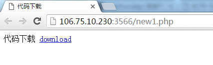
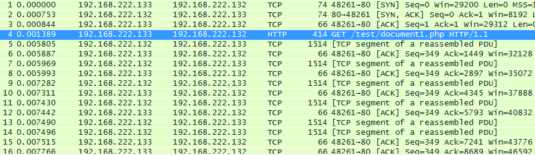
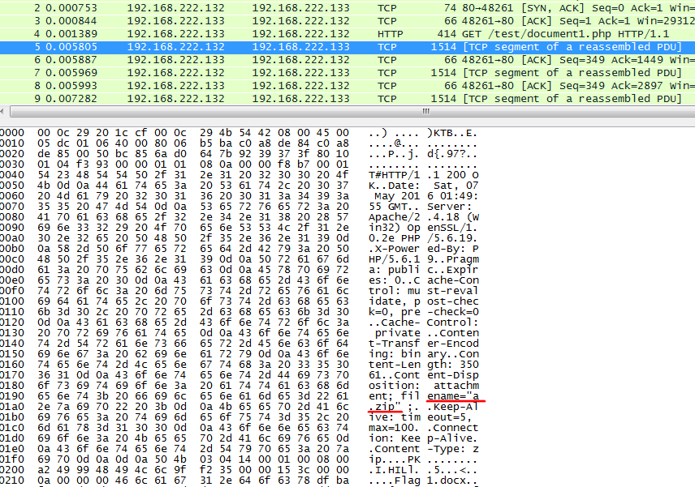
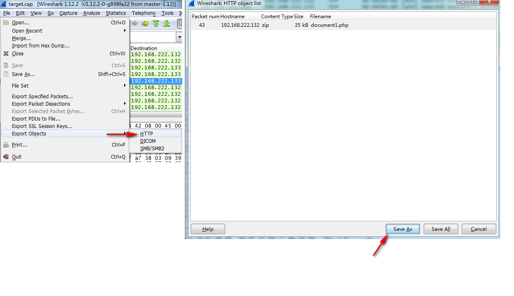

# 信息

脑洞题，提示：华科官网

`score 200` `Type web` `source:whctf2016`

## 题目信息

[官网题目地址](http://106.75.10.230:3566) &nbsp;&nbsp;
[题目收集](https://github.com/ssst0n3/ctf-wp/blob/master/2016/whctf/web/target.zip)

打开网页后发现提供了一个压缩包

下载下来是一个抓包文件`target.cap`

## 题解

使用wireshark打开，简单浏览一下，就是一个get请求

简单分析一下请求的内容是文件`a.zip`

这时可以直接用wireshark导出文件，也可以自己手动提取出来

打开之后是一个压缩包，根据提示(华科官网)解压密码为`www.hust.edu.cn`,打开压缩包后发现三个文档，flag即在第三个文档中
